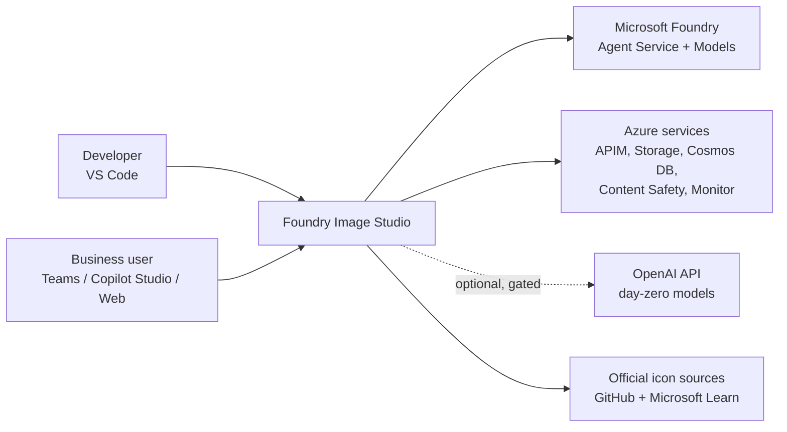
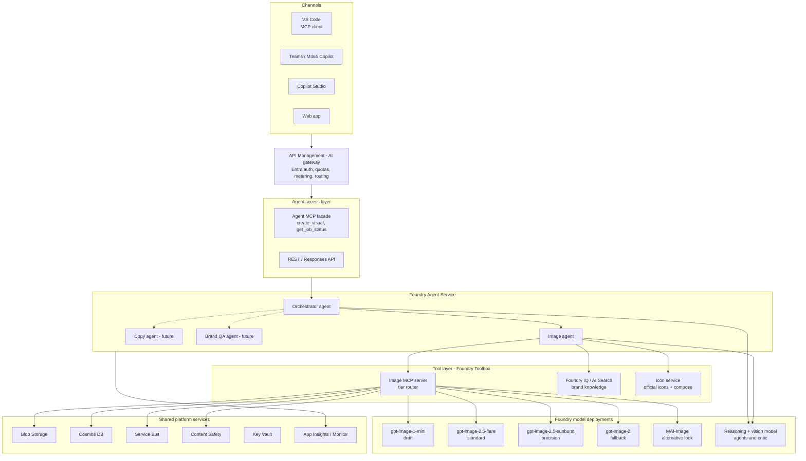
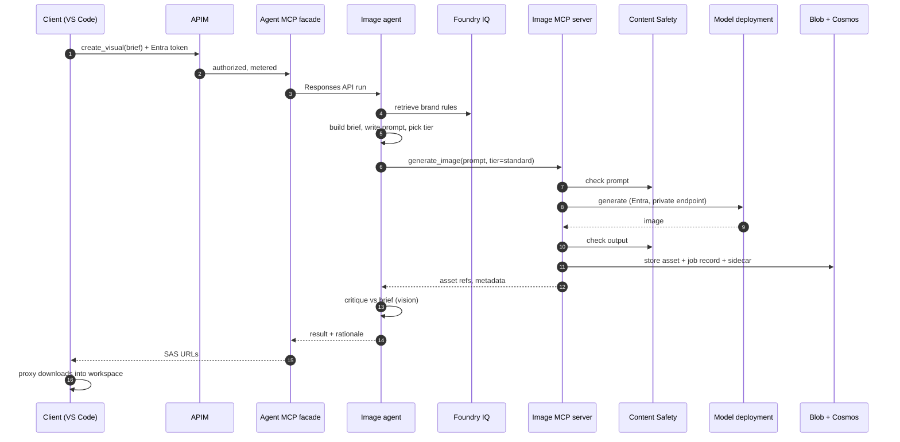
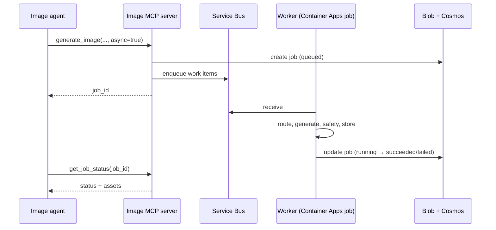
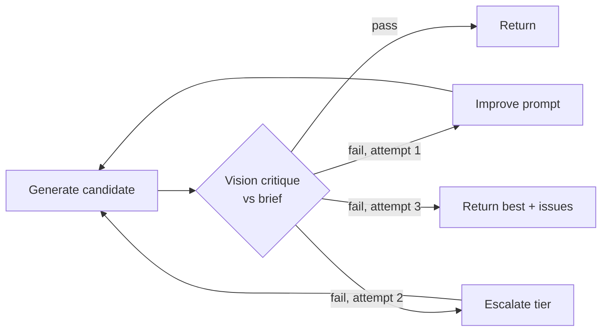
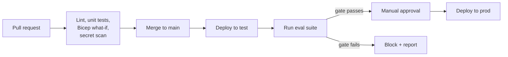

# Architecture: AIDevMe Foundry Image Studio

> Multi-agent image generation on Microsoft Foundry: an orchestrator plus specialist agents, tier-based model routing, an MCP server for VS Code, reusable agent skills, and official Microsoft product icons.

| | |
|---|---|
| **Repository** | `aidevme-foundry-image-studio` |
| **Status** | Proposed (v0.2) |
| **Owner** | Zsolt Zombik |
| **Last updated** | 2026-09-29 |
| **Platform** | Microsoft Foundry (Agent Service, Models, Toolboxes), Azure |
| **Facts verified** | 2026-09-29 against the subscription model catalog, regions and quota (see [§6.1](#61-image-model-catalog-foundry-sold-directly-by-azure)) |

---

### Changes in v0.2

This revision closes the gaps found while implementing the first infrastructure, and it records decisions taken since v0.1.

| Ref | Change | Section |
|---|---|---|
| G-1 | Added the `overlay_text` tool contract for long in-image text. | [§7.1](#71-internal-image-mcp-server-agents-only) |
| G-2 | Defined `brief_id` as the id of the job record that holds the brief. | [§7.1](#71-internal-image-mcp-server-agents-only), [§9.2](#92-job-record-cosmos-db-container-jobs-partition-key-tenantid) |
| G-3 | Added `vary_visual` and `upscale_visual` to the facade, and stated that `alternative` is not client-selectable. | [§7.2](#72-external-agent-mcp-facade-clients) |
| G-4 | Added the composite index that `list_recent_visuals` needs. | [§9.2](#92-job-record-cosmos-db-container-jobs-partition-key-tenantid) |
| G-5 | Corrected the repository structure to the actual layout. | [§18](#18-repository-structure) |
| G-6 | Stated that the four product skills do not exist yet. | [§12](#12-agent-skills) |
| G-7 | Defined a 50 s agent-run budget inside the 60 s facade timeout. | [§15](#15-reliability-scaling-and-performance) |
| G-8 | Recorded that image models are offered only as `GlobalStandard`, which conflicts with EU-only processing. | [§2.2](#22-quality-attributes), [§6.1](#61-image-model-catalog-foundry-sold-directly-by-azure), [§21](#21-risks-and-open-questions) |
| G-9 | Decided the region (Sweden Central) and removed the EU Data Zone fallback that image models cannot use. | [§2.3](#23-constraints), [§6.3](#63-routing-rules), [§15](#15-reliability-scaling-and-performance), [§20](#20-architecture-decision-records) |
| G-10 | Replaced generic model names with the verified catalog names, versions, and status. | [§5.1](#51-agent-inventory), [§6.1](#61-image-model-catalog-foundry-sold-directly-by-azure) |
| G-11 | Documented the deployment identity, its OIDC subject format, and its roles. | [§10.1](#101-identity-model), [§10.2](#102-rbac-least-privilege) |
| G-12 | Replaced `azd` with the implemented Bicep and GitHub Actions approach, and added naming and lifecycle rules. | [§17](#17-deployment-and-environments) |
| G-13 | Added backup and recovery facts, and marked RPO and RTO as undecided. | [§2.2](#22-quality-attributes), [§15](#15-reliability-scaling-and-performance) |
| G-14 | Added observed risks: search capacity, slow account creation, soft-delete name reservation, and low default quota. | [§21](#21-risks-and-open-questions) |
| G-15 | Added ADR-010 to ADR-014 and new open questions. | [§20](#20-architecture-decision-records), [§21](#21-risks-and-open-questions) |

---

## Contents

1. [Purpose and scope](#1-purpose-and-scope)
2. [Architecture drivers](#2-architecture-drivers)
3. [Solution overview](#3-solution-overview)
4. [Logical components](#4-logical-components)
5. [Agent design](#5-agent-design)
6. [Model strategy](#6-model-strategy)
7. [Tool contracts (MCP)](#7-tool-contracts-mcp)
8. [Key flows](#8-key-flows)
9. [Data architecture](#9-data-architecture)
10. [Security and identity](#10-security-and-identity)
11. [Responsible AI and content governance](#11-responsible-ai-and-content-governance)
12. [Agent skills](#12-agent-skills)
13. [VS Code and developer consumption](#13-vs-code-and-developer-consumption)
14. [Observability and evaluation](#14-observability-and-evaluation)
15. [Reliability, scaling and performance](#15-reliability-scaling-and-performance)
16. [Cost management](#16-cost-management)
17. [Deployment and environments](#17-deployment-and-environments)
18. [Repository structure](#18-repository-structure)
19. [Roadmap](#19-roadmap)
20. [Architecture decision records](#20-architecture-decision-records)
21. [Risks and open questions](#21-risks-and-open-questions)
22. [References](#22-references)

---

## 1. Purpose and scope

### 1.1 Problem

Teams need on-brand, governed images (blog heroes, social cards, slide backgrounds, product shots, architecture visuals with Microsoft product icons) produced quickly from where they already work: VS Code, Teams, Copilot Studio, or a web app. Calling a single image model directly gives no brand grounding, no quality control, no cost control, and no audit trail. It also locks the solution to one model at a time when better models ship every few months.

### 1.2 Goals

- **G1:** A multi-agent system on Microsoft Foundry. The first specialist is an **image agent**; further agents (copy, brand QA) plug into the same structure.
- **G2:** **Multiple image models** behind one stable interface, selected by *tier* (`draft`, `standard`, `precision`) rather than by model name.
- **G3:** Consumption from **VS Code** (GitHub Copilot agent mode, Claude Code, any MCP client) with images saved directly into the workspace.
- **G4:** Enterprise-grade governance: Entra ID everywhere, private networking, content safety, provenance, per-team metering.
- **G5:** Correct use of **official Microsoft product icons** (never model-drawn logos).
- **G6:** Measurable quality through evaluations, so model changes are data-driven.

### 1.3 Non-goals

- Video generation (Sora) and audio. The design leaves room for them as future specialist agents.
- Training or fine-tuning image models.
- A full digital asset management (DAM) system. Output lands in Blob Storage and the workspace; DAM integration is a later extension.
- Generating images of real, identifiable people.

### 1.4 Glossary

| Term | Meaning |
|---|---|
| **Tier** | Abstract quality/speed class (`draft`, `standard`, `precision`) that the router maps to a model deployment. |
| **Brief** | Structured description of a requested image (see [§12](#12-agent-skills)). |
| **Image MCP server** | Internal MCP server exposing image tools and routing to models. |
| **Agent MCP facade** | External MCP server that exposes the *agent* (not the raw tools) to VS Code and other clients. |
| **Prompt agent** | Foundry agent defined by configuration (instructions, model, tools); Foundry runs it. |
| **Hosted agent** | Foundry agent whose code (e.g. Microsoft Agent Framework) runs in a container managed by Foundry. |
| **Toolbox** | Foundry feature for curating tools once and reusing them across agents. |

---

## 2. Architecture drivers

### 2.1 Functional requirements

| ID | Requirement |
|---|---|
| FR1 | Generate images from a natural-language request, with size, count, background and style control. |
| FR2 | Edit existing images (inpaint with mask, swap background, change one element, fix in-image text) while preserving everything else. |
| FR3 | Produce variations and upscale an accepted image. |
| FR4 | Ground requests in brand guidelines (palette, tone, do/don't lists). |
| FR5 | Compose official Microsoft product/Azure icons onto generated backdrops. |
| FR6 | Support synchronous (single image) and asynchronous (batch, slow tiers) jobs. |
| FR7 | Save outputs to Blob Storage and, from VS Code, to the local workspace. |
| FR8 | Record prompt, tier, model, cost and safety results for every job. |

### 2.2 Quality attributes

| Attribute | Target |
|---|---|
| **Latency (standard tier, 1 image)** | p50 < 20 s, p95 < 45 s end-to-end including agent reasoning (validate against live measurements). |
| **Availability** | 99.5% for the API surface; graceful fallback to another tier or model when one deployment is throttled. |
| **Security** | No API keys in clients; managed identities; private endpoints in production. |
| **Data residency** | EU-hosted resources and EU-region deployments. **Caveat:** every image model in the verified catalog is offered only with the `GlobalStandard` SKU, which can process prompts and images outside the EU, and a Data Zone (EU) deployment is not available for them. See [§6.1](#61-image-model-catalog-foundry-sold-directly-by-azure), risk R-8 and open question 8. |
| **Extensibility** | Add or swap a model with a configuration change only; add an agent without changing existing agents. |
| **Auditability** | Every generated asset traceable to request, user, prompt, model version and safety verdict. |
| **Cost control** | Per-user/team quotas and chargeback via API Management. |
| **Recovery** | Not yet defined: RPO and RTO targets need an owner decision (open question 9). Backup facts are in [§15](#15-reliability-scaling-and-performance). |

### 2.3 Constraints

- Microsoft Foundry is the agent and model platform; Azure is the hosting platform.
- Enterprise clients in the DACH/Benelux market: expect security reviews, data-processing agreements and preference for a single cloud vendor.
- Several models and Foundry features used here are **preview** at the time of writing. Every preview dependency is isolated behind an interface (see [§21](#21-risks-and-open-questions)).
- Microsoft icon usage terms: icons may be used unmodified in architecture diagrams, training and documentation.
- **Region (decided, [ADR-010](#20-architecture-decision-records)):** Sweden Central. On 2026-09-29 the subscription model catalog (`az cognitiveservices model list`) showed that, of the regions checked, only Sweden Central offers all image models (`gpt-image-1-mini`, `gpt-image-2`, `gpt-image-2.5-flare`, `gpt-image-2.5-sunburst`) and MAI-Image. West Europe and France Central lack the `gpt-image` models. East US 2 and West US 3 have the `gpt-image` models but no MAI-Image.
- **Quota:** the default quota for image models is very low (see [§15](#15-reliability-scaling-and-performance)). Plan quota requests before load tests.

---

## 3. Solution overview

### 3.1 Context



### 3.2 Layered view



### 3.3 Architectural principles

1. **Agents reason; tools act.** LLM agents classify intent, enrich prompts, choose tiers and judge results. Pixels are produced only by tools behind the Image MCP server.
2. **Tiers, not model names.** Agent instructions, tool contracts and client configs mention only tiers. Model changes are configuration.
3. **One interface per audience.** External clients see the *agent* through a small facade; only agents see the raw image tools. Internals can change without touching anything developers installed.
4. **Foundry first.** All models are consumed as Foundry deployments by default; external providers are an explicit, gated exception ([ADR-004](#20-architecture-decision-records)).
5. **No base64 in conversations.** Images move as Blob references (short-lived SAS URLs or paths), never through an agent's context window.
6. **Everything is traceable.** Each asset has a job record and a sidecar with brief, prompt, tier, deployment, version and safety verdict.
7. **Official icons are composited, never generated.**

---

## 4. Logical components

| # | Component | Responsibility | Azure / Foundry service | Hosting notes |
|---|---|---|---|---|
| C1 | **Channels** | User interaction | VS Code, Teams, Copilot Studio, web app | Copilot Studio can call Foundry agents as connected agents or over the API. |
| C2 | **AI gateway** | Auth, quotas, rate limits, cost metering, routing, logging | Azure API Management (AI gateway policies) | One product per consumer group; token/image metering per subscription. |
| C3 | **Agent MCP facade** | Exposes the orchestrator as a few high-level MCP tools | Azure Container Apps or Functions | Streamable HTTP MCP; Entra-protected. |
| C4 | **Orchestrator agent** | Intent routing, multi-step workflows, conversation state | Foundry Agent Service (prompt agent, later hosted) | Calls specialists as connected agents or via workflow. |
| C5 | **Image agent** | Brief creation, prompt enrichment, tier selection, critique | Foundry Agent Service (prompt agent → hosted agent in phase 2) | Uses Image MCP, Foundry IQ, icon service. |
| C6 | **Image MCP server** | `generate_image`, `edit_image`, `variations`, `upscale`, `get_job_status`; tier→deployment routing; safety checks; storage | Azure Container Apps (recommended) or Functions | Registered once in a Foundry Toolbox. |
| C7 | **Model router** | Maps tier + request features to a deployment; fallback; provider abstraction | Library inside C6, config in App Configuration | Hot-reloadable routing table. |
| C8 | **Model deployments** | Image generation and editing; agent reasoning and vision critique | Foundry Models (sold directly by Azure) | Pinned versions; region or EU Data Zone deployments. |
| C9 | **Brand knowledge** | Brand guidelines, palettes, approved styles, reference images | Foundry IQ / Azure AI Search, Blob | Indexed from a `brand/` folder or SharePoint. |
| C10 | **Icon service** | Find official icons and compose them onto images | Container in C6 or separate function | Wraps `find_icon.py` and `compose.py` from the skills. |
| C11 | **Job queue** | Async and batch jobs, retries, back-pressure | Azure Service Bus | Sessions per job; dead-letter queue monitored. |
| C12 | **Asset store** | Generated images, masks, references, sidecars | Azure Blob Storage | Private; access via user-delegation SAS. |
| C13 | **Job store** | Job records, audit, eval data | Azure Cosmos DB (NoSQL) | Partition by `tenantId`. |
| C14 | **Content safety** | Prompt and image moderation beyond model built-ins | Azure AI Content Safety | Also Prompt Shields for injection in user-supplied text/images. |
| C15 | **Secrets and config** | External provider keys, routing table | Key Vault, App Configuration | Managed identity access only. |
| C16 | **Observability** | Traces, metrics, logs, agent evaluations | Application Insights, Azure Monitor, Foundry tracing and Agent Monitoring Dashboard | OpenTelemetry end to end. |
| C17 | **Local MCP proxy** | Bridges VS Code to C3; downloads outputs into the workspace | npm package `@aidevme/image-studio-mcp` (stdio); source in `src/vscode-proxy/` | Uses the developer's Azure sign-in. |

---

## 5. Agent design

### 5.1 Agent inventory

| Agent | Type | Model | Tools | Phase |
|---|---|---|---|---|
| **Orchestrator** | Prompt agent (hosted later if workflows get complex) | Reasoning model (`gpt-5.4`, version 2026-03-05, available in Sweden Central; see [§6.1](#61-image-model-catalog-foundry-sold-directly-by-azure)) | Connected agents: image, copy, QA; `get_job_status` | 2 |
| **Image agent** | Prompt agent in phase 1; hosted agent (Agent Framework) in phase 2 | Reasoning + vision model | Image MCP (via Toolbox), Foundry IQ, icon service | 1 |
| **Copy agent** | Prompt agent | Reasoning model | Foundry IQ (brand voice), web search | 3 |
| **Brand QA agent** | Prompt agent | Vision model | Foundry IQ, Content Safety, image analysis | 3 |

In phase 1 the image agent is exposed directly through the facade; the orchestrator is added in phase 2 without changing the facade contract.

### 5.2 Image agent responsibilities

1. **Understand** the request and any attached images.
2. **Brief**: build a structured brief (purpose, subject, composition, style, palette, exact text, size, tier, references, `needs_official_icons`). See the `image-brief` skill.
3. **Ground**: retrieve brand rules from Foundry IQ and merge them into the brief.
4. **Prompt**: write the model prompt in a fixed order: subject → composition → style → lighting/palette → exact text → constraints.
5. **Route**: choose the tier; pass optional routing hints (`needs_text`, `needs_transparency`, `edit_chain`).
6. **Generate or edit** through the Image MCP server.
7. **Critique**: score the output with the vision model against the brief (see [§8.5](#85-critic-loop)); retry or escalate the tier when needed.
8. **Compose icons** when `needs_official_icons` is true.
9. **Return** asset references, the final prompt, tier used and a one-line rationale.

### 5.3 Instruction skeleton (image agent)

```text
You are the Image agent of AIDevMe Foundry Image Studio.

Always:
- Build a brief before generating. Ask at most one question, and only when a wrong guess
  would waste a precision-tier generation.
- Choose a tier: draft (exploration, thumbnails), standard (default), precision (hero assets,
  exact in-image text, multi-step edits). Never name a model.
- Apply brand rules from the knowledge tool. Brand rules override user style requests
  unless the user explicitly asks for an off-brand exploration.
- Never draw Microsoft or third-party logos. If products must appear, reserve empty space
  and call compose_icons with official icons.
- Never generate identifiable real people, or lookalikes of trademarked characters.
- Pass images as references (asset ids / URLs), never as base64.
- After each result, run the critique checklist. Retry once with a better prompt; then
  escalate one tier; stop after three attempts and report what is still wrong.
- Return: asset links, tier used, attempts, and the final prompt.
```

### 5.4 Orchestrator responsibilities (phase 2)

- Classify intent: `image`, `copy`, `image+copy` (e.g. a social post), `review`.
- Run multi-step workflows. For example, a blog-hero workflow: copy agent writes headline → image agent generates hero with reserved space → icon composition → brand QA agent checks → return bundle.
- Own conversation state and job fan-out; return job ids for long workflows.
- Enforce per-request budgets (maximum attempts, maximum precision-tier calls).

### 5.5 Prompt agent vs hosted agent

| Concern | Prompt agent | Hosted agent (Agent Framework) |
|---|---|---|
| Time to first version | Minutes | Days |
| Custom control flow (parallel generation, deterministic critic loop) | Limited to what the model decides | Full control in code |
| Compute to manage | None | Container managed by Foundry |
| Testing | Playground + evals | Unit tests + local run + evals |
| Choice here | Phase 1 for both agents | Image agent in phase 2 for the critic loop and parallel A/B generation |

---

## 6. Model strategy

### 6.1 Image model catalog (Foundry, sold directly by Azure)

| Model | Version verified in Sweden Central | Status | Role in this design | Notes |
|---|---|---|---|---|
| `gpt-image-1-mini` | 2025-10-06 | GA | **draft** tier | Cheapest; thumbnails, bulk variants, exploration. |
| `gpt-image-2.5-flare` | 2026-09-08 | GA | **standard** tier (default) | OpenAI's recommended default for most applications; faster than gpt-image-2 with higher quality per OpenAI. |
| `gpt-image-2.5-sunburst` | 2026-09-08 | GA | **precision** tier | Slower; best for precise, multi-step edits and hero assets. |
| `gpt-image-2` | 2026-04-21 | GA | **fallback** | Used when a 2.5 deployment is throttled or not available. |
| `gpt-image-1.5`, `gpt-image-1` | 2025-12-16, 2025-04-15 | GA, preview | Not used by default | Kept only if an existing workflow depends on them. |
| `MAI-Image-2.6`, `MAI-Image-2.6-Flash` | 2026-07-31 | Preview | **alternative look** (candidate) | Second candidate in A/B critic runs; photoreal speed. Which MAI model becomes the `alternative` tier is decided by the evaluation gate (open question 3). Deployment `format` is `Microsoft`. |
| `MAI-Image-2.5`, `-2.5-Flash`, `-2.5-Pro` | 2026-06-02, 2026-06-02, 2026-06-19 | Preview | Alternatives to evaluate | Older preview generation. |
| `MAI-Image-2`, `MAI-Image-2e` | 2026-02-20, 2026-04-09 | Deprecated | Not used | Do not deploy. |
| Catalog models (e.g. `FLUX.2-pro`, `FLUX-1.1-pro`) | 1 | GA | Optional | Stylistic range. Offered with `GlobalStandard` and `DataZoneStandard`. |

**Observed facts (2026-09-29, subscription catalog, `az cognitiveservices model list`)**

- Every image model above is offered with the **`GlobalStandard`** SKU only. No `DataZoneStandard` or `Standard` (regional) option exists for them. This drives [ADR-010](#20-architecture-decision-records) and risk R-8.
- Regions checked: Sweden Central has all image models and MAI-Image. East US 2 and West US 3 have the four `gpt-image` models but no MAI-Image. East US, West US, West Central US and West Europe have MAI-Image but no `gpt-image` models. France Central, North Central US, South Central US and Central US have neither.
- The agent reasoning model is `gpt-5.4` (2026-03-05, GA, `GlobalStandard`). The catalog does not state whether it accepts image input, so vision use in the critic must be confirmed before phase 2 (open question 11).

Reasoning and vision models for agents and the critic are deployed separately in the same Foundry project.

> Availability, preview status, limited-access requirements and regions change often. Verify against the Foundry model catalog and region availability page before each environment rollout.

### 6.2 Tier routing table

The router reads a table like this from App Configuration:

```yaml
routing:
  draft:
    primary:  { provider: foundry, deployment: img-draft-gpt-image-1-mini }
    fallback: []
    defaults: { quality: low }
  standard:
    primary:  { provider: foundry, deployment: img-std-gpt-image-2-5-flare }
    fallback:
      - { provider: foundry, deployment: img-fb-gpt-image-2 }
    defaults: { quality: medium }
  precision:
    primary:  { provider: foundry, deployment: img-prec-gpt-image-2-5-sunburst }
    fallback:
      - { provider: foundry, deployment: img-std-gpt-image-2-5-flare, quality: high }
    defaults: { quality: high }
  alternative:
    primary:  { provider: foundry, deployment: img-alt-mai-image }

overrides:
  - when: { tenant.external_allowed: true, feature: "day-zero" }
    use:  { provider: openai, model: "<new-model>" }   # gated, see ADR-004
```

### 6.3 Routing rules

| Condition | Result |
|---|---|
| Brief tier set | Use that tier's primary deployment. |
| `edit_chain >= 3` | Force `precision` for every step. |
| `text_in_image.required` and text longer than ~8 words | Generate without text; overlay text in code. |
| Primary returns 429 / 5xx after retries | Next fallback; record `fallback_used=true`. |
| Primary deployment region lacks the model or capacity | Route to the fallback deployment in a second region. Image models have no EU Data Zone option ([§6.1](#61-image-model-catalog-foundry-sold-directly-by-azure)), so the second region must be chosen explicitly (open question 8). Until then, fall back to another tier in the same region. |
| Request exceeds per-user budget | Downgrade to `standard`, or reject with a budget error when the brief demands precision. |

### 6.4 Version management

- Deploy **pinned model versions** (e.g. `...-2026-09-08`) with the version-upgrade policy set to *manual* in production.
- Never route production traffic to moving aliases such as `chatgpt-image-latest`.
- New versions go through the evaluation gate ([§14.3](#143-evaluation)) in the `test` environment before the routing table changes in production.
- Keep the previous deployment for at least one release as a rollback target.

### 6.5 Provider abstraction

```text
interface ImageProvider {
  generate(req: GenerateRequest): Promise<ImageResult[]>
  edit(req: EditRequest): Promise<ImageResult[]>
  capabilities(): { maxSize, transparent, mask, maxReferences, qualities }
}
FoundryImageProvider  -> Foundry deployment, Entra token (default)
OpenAIImageProvider   -> OpenAI API, key from Key Vault (gated)
FoundryCatalogProvider-> Serverless catalog models (FLUX, MAI) with model-specific parameter mapping
```

Each provider normalizes parameters (size, quality, background, mask, references) and returns the same result shape, so the router and agents never see provider differences.

---

## 7. Tool contracts (MCP)

### 7.1 Internal: Image MCP server (agents only)

| Tool | Purpose |
|---|---|
| `generate_image` | New images from a prompt. |
| `edit_image` | Edit with instruction, optional mask and reference images. |
| `variations` | Alternatives of an existing asset. |
| `upscale` | Upscale an accepted asset. |
| `compose_icons` | Place official icons on an asset. |
| `overlay_text` | Render long or exact text onto an asset in code (see [§6.3](#63-routing-rules)). |
| `get_job_status` | Poll an async job. |

**`generate_image` input**

```json
{
  "prompt": "string (final model prompt)",
  "tier": "draft | standard | precision | alternative",
  "size": "1536x1024",
  "count": 1,
  "background": "opaque | transparent",
  "output_format": "png | webp | jpeg",
  "quality": "optional override, else tier default",
  "hints": { "needs_text": false, "edit_chain": 0 },
  "brief_id": "string",
  "async": false
}
```

**`generate_image` output**

```json
{
  "job_id": "img_01J...",
  "status": "succeeded | queued | running | failed | blocked",
  "assets": [
    {
      "asset_id": "ast_01J...",
      "url": "https://<storage>/assets/...png?<user-delegation-sas, 15 min>",
      "width": 1536, "height": 1024, "format": "png"
    }
  ],
  "tier": "standard",
  "provider": "foundry",
  "deployment": "img-std-gpt-image-2-5-flare",
  "model_version": "2026-09-08",
  "fallback_used": false,
  "safety": { "prompt": "pass", "output": "pass" },
  "usage": { "input_tokens": 0, "output_tokens": 0, "est_cost_eur": 0.0 },
  "request_id": "provider request id"
}
```

**`edit_image` input**

```json
{
  "image": "asset_id | url",
  "instruction": "Change: ... Keep unchanged: ...",
  "mask": "asset_id | url (optional; transparent = editable)",
  "references": ["asset_id | url"],
  "tier": "standard | precision",
  "size": "same | WxH",
  "async": false
}
```

**`compose_icons` input**

```json
{
  "backdrop": "asset_id | null",
  "canvas": { "width": 1536, "height": 1024, "color": "#0F172A" },
  "icons": [
    { "product": "Copilot Studio", "x": 0.3, "y": 0.45, "size": 180, "label": true, "plate": "#FFFFFF" }
  ]
}
```

**`overlay_text` input** (proposed, [ADR-013](#20-architecture-decision-records))

```json
{
  "image": "asset_id | url",
  "text": "string (exact text, UTF-8)",
  "font": { "family": "string (from the brand fonts in the brand container)", "size": 48, "weight": 700, "color": "#FFFFFF" },
  "box": { "x": 0.08, "y": 0.10, "width": 0.50, "height": 0.30, "align": "left | center | right" }
}
```

The tool returns a new asset linked to the source (`parent_asset_id`) and a sidecar that records the text and font. It fails with `TEXT_OVERFLOW` when the text does not fit the box.

Contract rules:

- Inputs never contain base64; images are passed as asset ids or URLs.
- `tier` is required; model names are rejected.
- `brief_id` is the id of the job record that holds the brief ([§9.2](#92-job-record-cosmos-db-container-jobs-partition-key-tenantid)). The image agent creates the brief with its first tool call, and later calls in the same request pass the same `brief_id`.
- Errors use MCP error results with codes: `BLOCKED_BY_SAFETY`, `BUDGET_EXCEEDED`, `UNSUPPORTED_SIZE`, `PROVIDER_UNAVAILABLE`, `INVALID_MASK`, `TEXT_OVERFLOW`.

### 7.2 External: Agent MCP facade (clients)

| Tool | Purpose |
|---|---|
| `create_visual` | Natural-language brief → images via the agent. |
| `edit_visual` | Edit an existing image via the agent. |
| `get_job_status` | Poll async work. |
| `list_recent_visuals` | The caller's recent assets. |
| `vary_visual` (phase 2) | Alternatives of an existing asset through the agent. |
| `upscale_visual` (phase 2) | Upscale an accepted asset through the agent. |

```json
{
  "name": "create_visual",
  "input": {
    "brief": "Blog hero for a post about Dataverse plugins, dark, isometric, space on the right for a headline",
    "count": 1,
    "tier": "auto | draft | standard | precision",
    "size": "auto | WxH",
    "target_path": "assets/generated/dataverse-plugins-hero.png",
    "include_products": ["Dataverse", "Power Apps"]
  }
}
```

The `tier` value `alternative` is not selectable by clients. The agent uses it internally in A/B mode ([§8.5](#85-critic-loop)).

The facade calls the agent through the Responses API on the Foundry project endpoint and returns asset URLs, job ids and the agent's rationale.

---

## 8. Key flows

### 8.1 Synchronous generation (standard tier)



### 8.2 Asynchronous and batch jobs

Used for precision-tier jobs, batches (e.g. "50 product shots"), and multi-step workflows.



- Workers scale on queue length (KEDA in Container Apps).
- Per-deployment concurrency limits prevent 429 storms.
- Failed items go to the dead-letter queue after retries; the job reports partial success.

### 8.3 Edit flow

1. Load the source asset; never overwrite it.
2. Classify the edit (background swap, object change, text fix, restyle, removal).
3. Build a mask if a region is involved.
4. Instruction format: `Change: <one change>. Keep unchanged: <identity, pose, framing, lighting, colors, other text>.`
5. Call `edit_image` at the tier the edit type requires; chains of three or more edits always use precision.
6. Compare the result to the source; retry with a tighter mask or keep-list if something drifted.
7. Store as a new version linked to the source (`parent_asset_id`).

### 8.4 Icon composition

1. The brief lists products; `needs_official_icons=true`.
2. The image agent generates a backdrop with empty positions reserved (e.g. empty pedestals).
3. `compose_icons` resolves each product to an official icon file (product icon index or the Azure architecture icon set), scales it uniformly and places it with a label.
4. Result is a new asset; the sidecar lists icon sources.

### 8.5 Critic loop



The critique checks, each scored 0–1:

- **Subject:** subject and count match the brief.
- **Composition:** composition matches, and the reserved space is actually empty.
- **Text:** exact text is correct.
- **Brand:** palette and style conform to the brand rules.
- **Artifacts:** no artifacts, no unwanted logos, no real people.

**A/B mode (phase 2):** generate with the primary and `alternative` tiers in parallel, score both, and return the better one (or both for user choice). Scores are stored as evaluation data.

### 8.6 Orchestrated workflow example: social post bundle (phase 3)

1. Orchestrator classifies the request as `image+copy`.
2. Copy agent writes the headline and post text in the brand voice.
3. Image agent generates a 1024×1024 visual with reserved headline space, then overlays the headline in code.
4. Brand QA agent checks palette, logo usage and text.
5. Orchestrator returns the bundle: image, alt text, post copy.

---

## 9. Data architecture

### 9.1 Blob layout

```text
assets/
  {tenantId}/{yyyy}/{mm}/{jobId}/
    {assetId}.png            # output
    {assetId}.json           # sidecar
    mask-{n}.png             # masks used
inputs/
  {tenantId}/{jobId}/        # user-supplied references (short retention)
brand/
  {tenantId}/                # brand guidelines, reference images (indexed)
icons/
  cache/                     # cached official icons
```

- Containers are private; clients receive **user-delegation SAS** URLs with a 15-minute lifetime.
- Lifecycle policy: `inputs/` deleted after 7 days; `assets/` moved to cool tier after 30 days; retention per tenant policy.
- Immutability policy optional for audited tenants.

### 9.2 Job record (Cosmos DB, container `jobs`, partition key `/tenantId`)

```json
{
  "id": "img_01J...",
  "tenantId": "hso-internal",
  "userId": "entra-object-id",
  "channel": "vscode",
  "type": "generate | edit | variation | upscale | compose",
  "status": "succeeded",
  "brief": { "purpose": "blog-hero", "subject": "...", "tier": "standard" },
  "prompt": "final model prompt",
  "tier": "standard",
  "provider": "foundry",
  "deployment": "img-std-gpt-image-2-5-flare",
  "modelVersion": "2026-09-08",
  "fallbackUsed": false,
  "attempts": 1,
  "critique": { "subject": 0.9, "composition": 0.85, "text": 1.0, "brand": 0.8 },
  "safety": { "prompt": "pass", "output": "pass", "categories": {} },
  "assets": ["ast_01J..."],
  "parentAssetId": null,
  "usage": { "estCostEur": 0.0 },
  "createdAt": "2026-09-29T08:40:00Z",
  "completedAt": "2026-09-29T08:40:18Z",
  "ttl": null
}
```

**Indexing and identity notes**

- The job record `id` is also the `brief_id` used by the tools ([§7.1](#71-internal-image-mcp-server-agents-only)). The brief is stored inside the record (`brief`).
- `list_recent_visuals` queries by user, but the partition key is `/tenantId`. The container has a composite index on `/userId` (ascending) and `/createdAt` (descending), so the query stays within one partition.
- `tenantId` identifies the consuming organization or team, not the Microsoft Entra tenant. In the first version there is a single value. It is present in every key and path so that adding tenants needs no schema change.

### 9.3 Sidecar (next to every asset)

Contains the job id, brief, final prompt, tier, provider, deployment, model version, icon sources, safety verdict, and provenance/C2PA info where the model supplies it. The same file is written next to the image in the VS Code workspace.

### 9.4 Data classification

| Data | Classification | Handling |
|---|---|---|
| Prompts and briefs | Internal (may contain confidential project names) | Stored in Cosmos; excluded from external providers unless tenant allows. |
| User reference images | Confidential | Short retention; never sent to external providers without tenant flag. |
| Generated assets | Internal until published | Private storage, SAS access. |
| Brand guidelines | Internal | Indexed in Foundry IQ / AI Search with tenant filters. |

---

## 10. Security and identity

### 10.1 Identity model

| Caller → callee | Mechanism |
|---|---|
| User (VS Code, web) → APIM | Entra ID OAuth 2.0 (auth code + PKCE; VS Code proxy uses `DefaultAzureCredential` / Azure sign-in). |
| APIM → facade | Validated JWT + APIM managed identity; facade trusts APIM only (private ingress). |
| Facade → Foundry agent | Managed identity with the Azure AI User role on the Foundry project. |
| Agent → Toolbox / Image MCP | Agent identity (Entra Agent ID for published agents) with a scoped app role. |
| Image MCP → model deployments | Managed identity, Cognitive Services / Foundry user role. No keys. |
| Image MCP → Storage, Cosmos, Service Bus, Content Safety | Managed identity with data-plane RBAC. |
| Image MCP → OpenAI (gated) | API key in Key Vault, read via managed identity. |
| GitHub Actions → Azure | OIDC federation from a Microsoft Entra app registration, with one federated credential per GitHub environment (`dev`, `test`, `prod`). No secret is stored in GitHub. This repository uses **immutable OIDC subject claims**, so the subject carries numeric IDs: `repo:<owner>@<owner-id>/<repo>@<repo-id>:environment:<name>`. The comparison is case-sensitive, so the environment name in the workflow and the credential must match exactly. |

Agents that are published get their own identity, distinct from the project's managed identity. Permissions must be re-granted to the agent identity after publishing.

### 10.2 RBAC (least privilege)

| Principal | Role(s) | Scope |
|---|---|---|
| Facade MI | Azure AI User | Foundry project |
| Image MCP MI | Cognitive Services OpenAI User (or Foundry equivalent) | Model deployments |
| Image MCP MI | Storage Blob Data Contributor, Storage Blob Delegator | Storage account |
| Image MCP MI | Cosmos DB Built-in Data Contributor | `jobs` container |
| Image MCP MI | Azure Service Bus Data Sender/Receiver | Namespace |
| Image MCP MI | Cognitive Services User | Content Safety |
| Image MCP MI | Key Vault Secrets User | Key Vault (only if external provider enabled) |
| Developers | Custom `ImageStudio.User` app role | Facade app registration |
| Platform team | Contributor | Resource group (via PIM) |
| Deployment identity (GitHub Actions) | Contributor and User Access Administrator | Subscription. Limit the second role with a condition to the roles that the templates assign (data-plane and pull roles, none of Owner, User Access Administrator or RBAC Administrator). The templates run at subscription scope and create the resource group. |

### 10.3 Network

- **Production:** Foundry project, model endpoints, Storage, Cosmos DB, Service Bus, Key Vault and Content Safety behind **private endpoints** in a hub-spoke VNet; public network access disabled.
- **Agent Service:** standard agent setup with BYO VNet where required.
- **Container Apps:** internal environment; APIM (internal or Premium v2 with VNet integration) is the only public entry.
- **Egress:** the external OpenAI route, if enabled, egresses through Azure Firewall with an FQDN allowlist.

### 10.4 Threats and mitigations

| Threat | Mitigation |
|---|---|
| Prompt injection via user text or reference images | Prompt Shields on inputs; agents treat tool outputs and retrieved content as data; tool allowlist per agent. |
| Harmful or policy-violating content | Model content filters + Content Safety on prompt and output; blocked results never stored as assets. |
| Data exfiltration to external providers | External provider disabled by default; tenant-level flag; separate egress path with logging. |
| Token or key leakage | No keys in clients; managed identities; Key Vault with RBAC; secret scanning in CI. |
| Excessive cost (abuse or runaway loops) | APIM quotas; per-request attempt and precision budgets; alerts on spend anomalies. |
| Trademark misuse | Official icons only via compose; generation prompts forbid logos; brand QA check. |
| SAS URL sharing | 15-minute user-delegation SAS; no account keys; access logging. |

---

## 11. Responsible AI and content governance

- **Content filtering:** Foundry deployment content filters configured per environment, plus Azure AI Content Safety checks on the prompt and the output inside the Image MCP server.
- **Provenance:** keep C2PA / content credentials that the models attach; do not strip metadata in post-processing. Sidecars record the model and version.
- **People:** no generation or editing that creates or alters identifiable real people. Edits of user-owned photos preserve identity and do not change what a person appears to do or say.
- **Brands and characters:** no lookalikes of trademarked characters or logos. Microsoft product icons only through `compose_icons` using official files, unmodified, with the product name nearby.
- **Transparency:** outputs used publicly are labeled as AI-generated according to the publishing channel's policy.
- **Human review:** precision-tier assets for external publication require an approval step (phase 3: brand QA agent + human approver).
- **Logging for abuse monitoring:** blocked prompts are logged with category and user id; repeated violations trigger alerts.

---

## 12. Agent skills

Portable skills in the open `SKILL.md` format, shared by the Foundry agents (served through a Toolbox) and by developer clients (VS Code, Claude Code).

| Skill | Role |
|---|---|
| `image-brief` | Turns any request into the structured brief; decides tier, size and whether official icons are needed. |
| `image-generate` | Prompt structure, exploration strategy, review checklist, retry and escalation rules. |
| `image-edit` | Edit classification, masks, keep-lists, one change per call, drift checks. |
| `microsoft-product-icons` | Finds official icons (`find_icon.py`) and composites them unchanged (`compose.py`). |

**Status:** none of the four product skills exists yet (implementation plan task P0.6). The repository currently ships one process skill, `write-document`, which applies the documentation style and is not part of the image system.

**Brief schema (summary)**

```json
{
  "intent": "new | edit | variation | upscale",
  "purpose": "blog-hero | social-card | slide | diagram-backdrop | product-shot | icon | ui-illustration | other",
  "subject": "...", "composition": "...", "style": "...",
  "palette": ["#hex"],
  "text_in_image": { "required": false, "exact_text": "" },
  "size": "1536x1024", "background": "opaque | transparent",
  "count": 1, "tier": "draft | standard | precision",
  "references": [], "needs_official_icons": false,
  "avoid": [], "output_path": "assets/generated/<slug>.png"
}
```

**Icon sources**

| Source | Coverage |
|---|---|
| `DamoBird365/microsoft-cloud-icons` | Product icons (M365, Power Platform, Dynamics 365, Copilot, Entra, Fabric, Foundry), SVG + PNG, machine-readable `icons.json`. |
| Azure Architecture Center icon download | Official Azure service icons (SVG); extracted into `icons/azure` at build time. |
| Microsoft Learn icon pages (Power Platform, Dynamics 365, Fabric) | Verification of current icons. |

---

## 13. VS Code and developer consumption

### 13.1 Options

| Option | What VS Code sees | Use |
|---|---|---|
| A: raw tools | Image MCP server tools | Not recommended; bypasses agent logic, brand grounding and critique. |
| **B: agent facade (chosen)** | `create_visual`, `edit_visual`, `get_job_status` | Same behavior as every other channel. |

### 13.2 Local proxy

The stdio proxy `@aidevme/image-studio-mcp`:

1. Authenticates with the developer's Azure sign-in.
2. Forwards MCP calls to APIM → facade.
3. Downloads returned SAS URLs into the workspace (`OUTPUT_DIR`) and writes sidecars.
4. Returns local file paths to the client, so no image bytes enter the model's context.

```json
{
  "servers": {
    "image-studio": {
      "type": "stdio",
      "command": "npx",
      "args": ["-y", "@aidevme/image-studio-mcp"],
      "env": {
        "IMAGE_STUDIO_ENDPOINT": "https://<apim>.azure-api.net/image-studio",
        "OUTPUT_DIR": "${workspaceFolder}/assets/generated"
      }
    }
  }
}
```

Remote-only alternative (no local files): `"type": "http"` pointing at the facade with Entra authentication.

### 13.3 Skills in the repo

Place the four skills under `.github/skills/` (GitHub Copilot) or `.claude/skills/` (Claude Code) in consuming repos so that client agents brief and review consistently with the Foundry agents.

### 13.4 Build-time tooling

- **Foundry Toolkit for VS Code** for authoring, local testing and tracing of the agents.
- **Foundry MCP Server** (cloud-hosted) in Copilot agent mode for managing deployments, quotas and evaluations from the editor.

### 13.5 Later: VS Code extension

A chat participant (`@image`) with inline previews, a gallery panel and "regenerate with alternative" buttons, calling the same facade. Build only if MCP UX proves insufficient.

---

## 14. Observability and evaluation

### 14.1 Telemetry

- OpenTelemetry across facade, agents (Foundry tracing), Image MCP server and workers; one trace id from APIM to model call.
- Custom dimensions: `tenantId`, `channel`, `tier`, `deployment`, `modelVersion`, `fallbackUsed`, `attempts`, `safetyVerdict`.

### 14.2 Key metrics and alerts

| Metric | Alert threshold (initial) |
|---|---|
| Job success rate | < 97% over 15 min |
| p95 latency per tier | > 2× baseline |
| Fallback rate | > 10% over 1 h |
| Safety block rate | Sudden spike > 3× baseline |
| 429 rate per deployment | > 5% |
| Average attempts per job | > 1.8 |
| Daily spend per tenant | > 120% of budget |
| DLQ depth | > 0 for 30 min |

Dashboards: the Foundry Agent Monitoring Dashboard for agent runs, token usage and evaluator scores; an Azure Monitor workbook for tiers, costs and safety.

### 14.3 Evaluation

- **Golden set:** 100–200 briefs covering purposes, text-in-image, transparency, edits and icon composition, stored in `evals/`.
- **Automated scoring:** vision-model judge with the critique rubric, plus text-accuracy OCR checks, plus safety pass rate.
- **Human spot checks:** 10% sample per release.
- **Gate:** a new model or version replaces a tier only if the rubric score is ≥ current − 0.02, text accuracy is not worse, p95 latency is within budget and cost per accepted image is within +20%.
- **Continuous:** production critique scores feed a weekly report per tier and deployment.

---

## 15. Reliability, scaling and performance

- **Retries:** exponential backoff with jitter on 429/5xx (max 3), honoring `retry-after`.
- **Fallback:** per-tier fallback chain ([§6.2](#62-tier-routing-table)); circuit breaker per deployment (open after 5 consecutive failures, half-open after 60 s).
- **Capacity:** separate deployments per tier to isolate quotas; request quota increases for the standard tier first; consider provisioned throughput (PTU) once volume is predictable. Observed default quota (2026-09-29, Sweden Central, `GlobalStandard`): `gpt-image-1-mini` 4, `gpt-image-2.5-flare` 2, `gpt-image-2.5-sunburst` 2, `gpt-image-2` 2, `gpt-5.4` 1000. The image quotas are too low for batch work, so request increases before load tests.
- **Multi-region:** primary in Sweden Central ([ADR-010](#20-architecture-decision-records)). Image models have no EU Data Zone deployment, and the only other regions observed with the `gpt-image` models are in the US (East US 2, West US 3). A fallback region is therefore an explicit residency decision (open question 8). Until it is made, the router falls back to another tier in the same region and never to another region.
- **Timeouts:** facade 60 s for sync calls; the agent run has a 50 s budget so that the facade can still return a job id before its own limit; anything expected to exceed it (precision, batches, count > 4) is automatically async.
- **Backup and recovery (as configured in the templates):** Blob soft delete and container soft delete for 7 days; Key Vault soft delete for 30 days with purge protection; App Configuration soft delete for 7 days; Cosmos DB with its default periodic backup (enable continuous backup for `prod` if the recovery target requires it). RPO and RTO are not defined (open question 9).
- **Idempotency:** clients send an `Idempotency-Key`; duplicate submissions return the existing job.
- **Back-pressure:** per-deployment concurrency semaphore in workers; queue-based load leveling.

---

## 16. Cost management

| Lever | Mechanism |
|---|---|
| Right tier by default | Brief skill defaults to `standard`; `precision` requires a reason. |
| Cheap exploration | Draft-tier 3-up before committing to standard or precision for open-ended requests. |
| Budgets | Per-request limits (max 3 attempts, max 1 precision escalation); per-user daily quota in APIM. |
| Chargeback | APIM products per team; usage and estimated cost per job in Cosmos; monthly report. |
| Caching | Reuse assets for identical brief hashes within a tenant (opt-in). |
| Storage | Lifecycle rules; short retention on inputs. |
| Commitments | Consumption on the Azure bill counts toward MACC; evaluate PTU at steady volume. |

Always check current prices on the Azure pricing page. The OpenAI list price for the same model can differ from Azure's.

---

## 17. Deployment and environments

### 17.1 Environments

| Env | Purpose | Network | Models |
|---|---|---|---|
| `dev` | Individual development | Public, IP-restricted | Draft + standard only |
| `test` | Integration and evaluation gate | Private endpoints | All tiers, candidate versions |
| `prod` | Production | Private endpoints, internal APIM | All tiers, pinned versions |

Only `dev` exists today. The GitHub environments are named `dev`, `test` and `prod`, matching the environment types in resource names.

### 17.2 Infrastructure as code

- **Bicep** in `.infrastructure/` ([ADR-011](#20-architecture-decision-records)): `main.bicep` at subscription scope (it creates the resource group), one module per service group under `modules/`, and one `main.<env>.bicepparam` file per environment. It is deployed with `az deployment sub create`. `azd` is not used, and there is no `azure.yaml`.
- Services in the templates: Foundry resource, project and model deployments; Content Safety; Storage; Cosmos DB; Key Vault; App Configuration; Azure AI Search; Container Registry; Container Apps environment and apps; API Management; Log Analytics and Application Insights; managed identities; role assignments. Service Bus and the worker job are behind `enableAsyncJobs`.
- **Not implemented yet:** virtual network, private endpoints, Azure Firewall, the API Management policy and products, and the `test` and `prod` parameter files. The `dev` environment uses public network access with Entra authentication.
- Agent definitions (instructions, tools, model) stored as YAML in `agents/` and applied by a deployment script through the Foundry SDK.
- Toolbox definitions in `toolboxes/`.

**Naming ([ADR-012](#20-architecture-decision-records)).** Environment-specific names contain the environment type (`dev`, `test`, `prod`) and a 13-character unique token, `toLower(uniqueString(subscription().id, environmentName, location))`. Storage accounts and container registries use a form without hyphens (`stdev<token>`, `crdev<token>`). Others use `<prefix>-<env>-<token>` (for example `kv-dev-<token>`, `cosmos-dev-<token>`). The resource group is `rg-image-studio-<env>`. The token is deterministic, so recreating an environment in the same subscription and region reuses the same names.

**Lifecycle and soft delete ([ADR-014](#20-architecture-decision-records)).** Deleting a resource group leaves soft-deleted Foundry, Content Safety, App Configuration, API Management and Key Vault resources whose names stay reserved. A new deployment with the same name fails until they are purged (or, for a Key Vault with purge protection, recovered). The `infra-delete` workflow purges what can be purged, and the `infra-deploy` workflow recovers a soft-deleted Key Vault before it deploys. Purge protection cannot be turned off once enabled, so enable it for `prod` only unless a reason exists for `dev` and `test`.

### 17.3 CI/CD (GitHub Actions, OIDC federation to Azure)

**Infrastructure (implemented).** Three workflows in `.github/workflows/`, all started manually (`workflow_dispatch`). Each runs in the GitHub environment of the same name, so required reviewers can gate it, and each signs in with the `environment:<name>` federated credential.

| Workflow | Purpose |
|---|---|
| `infra-validate.yml` | Lint and build the templates and the parameter file, warn about unresolved placeholders, and optionally run what-if. |
| `infra-deploy.yml` | Check repository variables and placeholders, run what-if, recover a soft-deleted Key Vault, and deploy. A preview-only option skips the deployment. |
| `infra-delete.yml` | Confirm by typing the resource group name, cancel a running deployment, delete the resource group, and purge soft-deleted resources. It tolerates resources that are already gone. A dry-run option lists what would be deleted. |

The subscription, tenant, client, region and publisher e-mail come from repository variables (`AZURE_SUBSCRIPTION_ID`, `AZURE_TENANT_ID`, `AZURE_CLIENT_ID`, `AZURE_LOCATION`, `APIM_PUBLISHER_EMAIL`).

**Application (target, not implemented).**



- Model version changes and routing-table changes are pull requests and go through the eval gate.
- The npm proxy package is published from tagged releases.

---

## 18. Repository structure

Items marked *(planned)* do not exist yet.

```text
aidevme-foundry-image-studio/
├── README.md
├── CONTRIBUTING.md
├── CLAUDE.md
├── src/
│   ├── image-mcp/                  # Image MCP server, router, providers, workers (stub)
│   ├── facade-mcp/                 # Agent MCP facade (stub)
│   ├── icon-service/               # find + compose (wraps skill scripts) (stub)
│   ├── vscode-proxy/               # @aidevme/image-studio-mcp (stdio) (stub)
│   └── shared/                     # contracts, telemetry, auth helpers (stub)
├── agents/                         # (planned) Foundry agent definitions
│   ├── orchestrator/agent.yaml
│   └── image/agent.yaml
├── toolboxes/                      # (planned)
│   └── image-studio.yaml           # Image MCP + icon tools + knowledge
├── skills/                         # (planned) the four product skills
│   ├── image-brief/
│   ├── image-generate/
│   ├── image-edit/
│   └── microsoft-product-icons/
├── config/
│   └── routing.yaml                # (planned) tier -> deployment table, seed for App Configuration
├── evals/                          # (planned)
│   ├── golden-set/
│   └── runners/
├── brand/                          # (planned) sample brand guidelines for grounding
├── assets/                         # repository images (social preview)
├── docs/
│   ├── index.md
│   ├── aidevme-foundry-image-studio/   # ARCHITECTURE, IMPLEMENTATION, INFRASTRUCTURE, SPECIFICATION
│   ├── claude/                     # agents, agent-memory, skills documentation
│   ├── templates/                  # document style
│   ├── adr/                        # (planned) ADR-001 ... ADR-014
│   └── runbooks/                   # (planned)
├── .infrastructure/                # Bicep: main.bicep, modules/, main.<env>.bicepparam, bicepconfig.json
├── .github/
│   ├── ISSUE_TEMPLATE/
│   ├── workflows/                  # infra-validate.yml, infra-deploy.yml, infra-delete.yml
│   └── skills/                     # (planned) copies for Copilot in this repo
└── .claude/                        # subagents, agent memory, and the write-document skill
```

---

## 19. Roadmap

| Phase | Scope | Exit criteria |
|---|---|---|
| **0: Foundations** (1–2 weeks) | IaC for dev; Foundry project; standard + draft deployments; repo, CI, skills in place | `azd up` works; a single image via SDK |
| **1: Image agent MVP** (2–3 weeks) | Image MCP server with router (3 tiers), Blob/Cosmos, Content Safety; image agent (prompt agent); facade + VS Code proxy | Developers generate and edit from VS Code; jobs traceable; p95 targets measured |
| **2: Quality and orchestration** (3–4 weeks) | Critic loop + A/B (hosted image agent); async jobs; orchestrator; eval suite and gate; icon composition service | Eval gate in CI; fallback tested; icons composited correctly |
| **3: More agents and channels** | Copy and brand QA agents; Teams / Copilot Studio channel; approval workflow; chargeback reports | Social-post bundle workflow in production |
| **4: Hardening and scale** | Private networking in prod, multi-region fallback, PTU evaluation, DR runbook | Security review passed; SLOs met for 30 days |

---

## 20. Architecture decision records

| ADR | Decision | Status |
|---|---|---|
| **ADR-001** | Use a custom Image MCP server instead of the built-in image generation tool, because the built-in tool binds to a single image deployment and can't route across models or vendors. | Accepted |
| **ADR-002** | Tier-based routing (`draft`, `standard`, `precision`) with model names only in configuration. | Accepted |
| **ADR-003** | Default mapping: draft → gpt-image-1-mini, standard → gpt-image-2.5-flare, precision → gpt-image-2.5-sunburst, fallback → gpt-image-2, alternative → MAI-Image. | Proposed, pending evals |
| **ADR-004** | Foundry deployments first; direct OpenAI API only as a gated provider for day-zero access, with keys in Key Vault and traffic through APIM. | Accepted |
| **ADR-005** | Expose the agent (not raw tools) to VS Code via an MCP facade plus a local stdio proxy that writes files to the workspace. | Accepted |
| **ADR-006** | Pin model versions; manual upgrade policy; never use moving aliases in production. | Accepted |
| **ADR-007** | Official Microsoft icons are composited, never generated. | Accepted |
| **ADR-008** | Prompt agents first; move the image agent to a hosted agent (Agent Framework) for the critic loop in phase 2. | Proposed |
| **ADR-009** | Images move as Blob references with short-lived user-delegation SAS; no base64 in agent context. | Accepted |
| **ADR-010** | Deploy to Sweden Central. It is the only region checked (2026-09-29) that offers all `gpt-image` models and MAI-Image. Consequence: image models are `GlobalStandard` only, so EU-only processing cannot be guaranteed (risk R-8). | Accepted |
| **ADR-011** | Provision with Bicep (subscription-scope `main.bicep` in `.infrastructure/`) deployed by manually started GitHub Actions workflows. `azd` is not used. | Accepted |
| **ADR-012** | Include the environment type and a deterministic unique token in resource names. | Accepted |
| **ADR-013** | Add an `overlay_text` tool so long or exact text is rendered in code, not by the image model. | Proposed |
| **ADR-014** | Key Vault uses purge protection, and the deploy workflow recovers a soft-deleted vault. Revisit for `dev` and `test`, where purge protection blocks clean recreation. | Accepted, to be revisited |

Full ADRs will live in `docs/adr/`. The folder does not exist yet (implementation plan task P0.2.1).

---

## 21. Risks and open questions

### 21.1 Risks

| Risk | Impact | Likelihood | Mitigation |
|---|---|---|---|
| Preview models/features change or are withdrawn | Rework, outages | Medium | Provider abstraction; fallback tier; eval gate before switching. |
| Model not available in the required EU region | Residency conflict | Medium | EU Data Zone deployment; fallback model in-region; document per-tenant. |
| Limited-access approval delays | Schedule slip | Medium | Apply early; start with GA models. |
| Quota limits for image models | Throttling | High in early phase | Separate deployments per tier; async queue; quota requests; PTU later. |
| Cost overrun from retries/precision tier | Budget | Medium | Budgets, alerts, draft-first exploration. |
| In-image text errors | Rework | Medium | Precision tier for text; overlay long text in code; OCR check. |
| **R-8** Image models are `GlobalStandard` only, so prompts and images may be processed outside the EU | Residency and contract conflict for EU clients | High (observed) | Decide the policy (open question 8): document the processing location, obtain client acceptance, or restrict to text-free briefs. Re-check the catalog for Data Zone options before each rollout. |
| Azure AI Search `basic` failed in Sweden Central with "insufficient capacity in region" (2026-09-29, after 39 min) | Blocks the whole deployment | Medium (observed) | Fail fast with a pre-check, use another SKU, or place Search in another region. Search stays a required service. |
| Foundry and Content Safety accounts stayed in `Creating` for over 45 minutes (2026-09-29) | Slow or stuck deployments | Medium (observed) | Cancel and retry, check Azure status, allow long timeouts, and purge failed accounts before redeploying. |
| Soft-deleted resources reserve names after a delete | Redeploy fails on name conflict | High | Purge (delete workflow), recover Key Vault (deploy workflow). See [§17.2](#172-infrastructure-as-code). |
| Default quota for image models is 2 to 4 units | Throttling under load | High (observed) | Request quota early. See [§15](#15-reliability-scaling-and-performance). |
| Trademark or likeness issues | Legal | Low–medium | Icon policy; people policy; brand QA; human approval for external use. |

### 21.2 Open questions

1. **Resolved:** Sweden Central is the primary region ([ADR-010](#20-architecture-decision-records)).
2. Is the orchestrator's multi-agent routing built with connected agents, Foundry workflows or Agent Framework workflows?
3. Should MAI-Image or a catalog model (FLUX) be the `alternative` tier after the first evals?
4. Which brand guidelines are the grounding source (SharePoint, repo, DAM)?
5. Retention periods per tenant and whether immutability is required.
6. Is an approval workflow needed from phase 1 for any external publication?
7. Which tenants, if any, may use the external OpenAI provider?
8. **Data residency:** is processing under the `GlobalStandard` SKU acceptable for EU clients, and which second region (if any) may host a fallback? ([§6.1](#61-image-model-catalog-foundry-sold-directly-by-azure))
9. What are the RPO and RTO for `prod`, and does Cosmos DB need continuous backup?
10. Does API Management (at the chosen SKU) support the streamable HTTP transport that MCP uses, and which SKU is required for virtual network integration? Neither is verified.
11. Does `gpt-5.4` (or the chosen reasoning model) accept image input for the critic step? The catalog does not say.
12. Which SKU and region should Azure AI Search use, given the capacity failure in Sweden Central?
13. Which MAI-Image model (2.6, 2.6-Flash, 2.5 family) becomes the `alternative` tier?

---

## 22. References

**Microsoft Foundry**
- Foundry Agent Service overview: https://learn.microsoft.com/azure/foundry/agents/overview
- Image generation tool in Agent Service: https://learn.microsoft.com/azure/foundry/agents/how-to/tools/image-generation
- Foundry Models sold directly by Azure (image models list): https://learn.microsoft.com/azure/foundry/foundry-models/concepts/models-sold-directly-by-azure
- What's new in Microsoft Foundry (monthly updates): https://devblogs.microsoft.com/foundry/
- Microsoft Agent Framework: https://github.com/microsoft/agent-framework

**OpenAI image models**
- Image generation guide: https://developers.openai.com/api/docs/guides/image-generation
- GPT Image 2.5 prompting guide: https://developers.openai.com/api/docs/guides/image-prompting
- GPT-Image-2.5 Flare: https://developers.openai.com/api/docs/models/gpt-image-2.5-flare
- GPT-Image-2.5 Sunburst: https://developers.openai.com/api/docs/models/gpt-image-2.5-sunburst

**Icons**
- Microsoft Cloud product icons: https://github.com/DamoBird365/microsoft-cloud-icons
- Azure architecture icons: https://learn.microsoft.com/azure/architecture/icons/
- Power Platform icons: https://learn.microsoft.com/power-platform/guidance/icons
- Dynamics 365 icons: https://learn.microsoft.com/dynamics365/get-started/icons

**Azure platform**
- Azure API Management AI gateway: https://learn.microsoft.com/azure/api-management/genai-gateway-capabilities
- Azure AI Content Safety: https://learn.microsoft.com/azure/ai-services/content-safety/
- Azure Developer CLI: https://learn.microsoft.com/azure/developer/azure-developer-cli/
