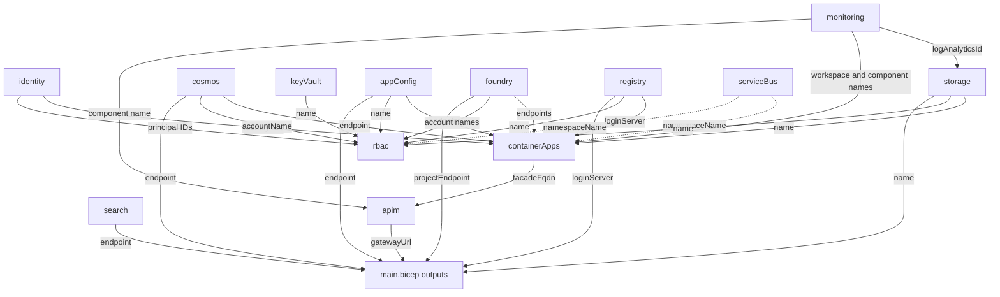

# Bicep code overview

| Field | Value |
| --- | --- |
| **Document Title** | Bicep code overview |
| **Document Location** | `docs/project-docs/bicep/index.md` |
| **Document Description** | Gives an overview of the Bicep templates in `bicep/` that provision the Azure resources of aidevme-foundry-image-studio: folder layout, module dependencies, naming, security defaults, parameters, the optional-service flags, local and workflow deployment, what is not implemented yet, known risks, and how to extend the templates. It is intended for engineers who deploy, review, or change the infrastructure code. |
| **Version** | 1.3 |
| **Last Updated On** | 2026-09-30 |

## Introduction

This document describes what the Bicep code in `bicep/` declares today. It is based on the template files, not on the design documents. Read it to find your way through the code, to check a security or naming rule, or before you add a module, a resource, or an environment. Each file has its own document, linked from this page. The design rationale is in [Infrastructure provisioning with Bicep](../../aidevme-foundry-image-studio/INFRASTRUCTURE.md) and the [architecture](../../aidevme-foundry-image-studio/ARCHITECTURE.md).

> **Important:** As far as the repository shows, no deployment of these templates has completed successfully. The implementation plan states that the first deployment to `dev` had not completed when it was last updated. This documentation was written from the source files. No template was deployed, and Azure was not called. The Azure behavior that this documentation describes is taken from the repository documents and is not observed unless a statement says so.

## Purpose and scope

The templates provision one Azure environment: a resource group and the services listed in the [module table](#modules). They implement the `dev` variant with public network access and Microsoft Entra authentication. They do not create agent definitions, toolbox registrations, search indexes, Microsoft Entra objects, or application images. Those items are outside Bicep ([INFRASTRUCTURE.md](../../aidevme-foundry-image-studio/INFRASTRUCTURE.md#what-bicep-does-not-provision)).

## Folder layout

```text
bicep/
├── main.bicep              # subscription-scope entry point: resource group and module calls
├── main.dev.bicepparam     # parameter values for the dev environment
├── bicepconfig.json        # linter rules
├── README.md               # one-time setup, deploy, delete, local run
└── modules/
    ├── monitoring.bicep    # Log Analytics workspace, Application Insights
    ├── identity.bicep      # two user-assigned managed identities
    ├── storage.bicep       # storage account, containers, lifecycle rules, diagnostics
    ├── cosmos.bicep        # serverless Cosmos DB account, database, jobs container
    ├── keyvault.bicep      # Key Vault with RBAC, soft delete, purge protection
    ├── appconfig.bicep     # App Configuration store for the routing table
    ├── foundry.bicep       # Foundry resource, project, model deployments, Content Safety
    ├── search.bicep        # Azure AI Search service
    ├── registry.bicep      # Container Registry
    ├── servicebus.bicep    # Service Bus namespace and queue (optional)
    ├── containerapps.bicep # environment, Image MCP app, facade app, worker job (optional)
    ├── apim.bicep          # API Management instance, backend, API, logger
    └── rbac.bicep          # role assignments
```

The GitHub Actions workflows that deploy these files are stored in `.github/workflows/`, because GitHub runs workflows only from that folder. They are documented in [GitHub Actions workflows](../github/workflows/index.md).

| Document | Covers |
| --- | --- |
| [main.bicep](main.md) | Parameters, variables, module calls, outputs, deployment order |
| [Parameter file and linter configuration](parameters.md) | `main.dev.bicepparam` and `bicepconfig.json` |
| [monitoring](modules/monitoring.md), [identity](modules/identity.md), [storage](modules/storage.md), [cosmos](modules/cosmos.md), [keyvault](modules/keyvault.md), [appconfig](modules/appconfig.md), [foundry](modules/foundry.md), [search](modules/search.md), [registry](modules/registry.md), [servicebus](modules/servicebus.md), [containerapps](modules/containerapps.md), [apim](modules/apim.md), [rbac](modules/rbac.md) | One document for each module |

## How the pieces fit together

`main.bicep` has `targetScope = 'subscription'`. It creates the resource group `rg-image-studio-<environmentName>` and calls the modules with `scope: rg`. Each module receives the region, the tags, and a name suffix, and returns only the names, endpoints, and identifiers that other modules need. `main.bicep` passes these outputs from one module to the next. Azure Resource Manager derives the deployment order from these references and runs independent modules in parallel ([deployment order](main.md#deployment-order)).

Two design rules shape the wiring:

- The identities are created in their own module, so `containerApps` (which attaches them) and `rbac` (which grants them roles) do not depend on each other.
- The modules return no key and no connection string. Access uses managed identities and roles.

## Modules

| Module | File | Resources created | Outputs | Consumed by |
| --- | --- | --- | --- | --- |
| `monitoring` | `monitoring.bicep` | Log Analytics workspace, Application Insights component | `logAnalyticsId`, `logAnalyticsName`, `appInsightsId`, `appInsightsName` | `storage` (`logAnalyticsId`), `containerApps` (`logAnalyticsName`, `appInsightsName`), `apim` (`appInsightsName`). `appInsightsId` is unused. |
| `identity` | `identity.bicep` | Two user-assigned managed identities | `imageMcpId`, `imageMcpPrincipalId`, `facadeId`, `facadePrincipalId` | `containerApps` (IDs), `rbac` (principal IDs) |
| `storage` | `storage.bicep` | Storage account, blob service, four containers, lifecycle policy, diagnostic setting | `name`, `id` | `containerApps` (`name`), `rbac` (`name`), `main.bicep` output. `id` is unused. |
| `cosmos` | `cosmos.bicep` | Cosmos DB account (serverless), SQL database, `jobs` container | `accountName`, `endpoint` | `rbac` (`accountName`), `containerApps` (`endpoint`), `main.bicep` output |
| `keyVault` | `keyvault.bicep` | Key Vault | `name`, `uri` | `rbac` (`name`). `uri` is unused. |
| `appConfig` | `appconfig.bicep` | App Configuration store | `name`, `endpoint` | `rbac` (`name`), `containerApps` (`endpoint`), `main.bicep` output |
| `foundry` | `foundry.bicep` | Foundry account, project, model deployments, Content Safety account | `accountName`, `endpoint`, `projectName`, `projectEndpoint`, `contentSafetyAccountName`, `contentSafetyEndpoint` | `rbac` (two account names), `containerApps` (three endpoints), `main.bicep` output (`projectEndpoint`). `projectName` is unused. |
| `search` | `search.bicep` | Azure AI Search service | `name`, `endpoint` | `main.bicep` output (`endpoint`) only. No module consumes it. |
| `registry` | `registry.bicep` | Container Registry | `name`, `loginServer` | `rbac` (`name`), `containerApps` (`loginServer`), `main.bicep` output |
| `serviceBus` (optional) | `servicebus.bicep` | Service Bus namespace, `image-jobs` queue | `namespaceName` | `containerApps`, `rbac` |
| `containerApps` | `containerapps.bicep` | Container Apps environment, Image MCP app, facade app, worker job (optional) | `facadeFqdn`, `imageMcpFqdn` | `apim` (`facadeFqdn`). `imageMcpFqdn` is unused. |
| `apim` | `apim.bicep` | API Management instance, backend, API, logger | `gatewayUrl`, `principalId` | `main.bicep` output (`gatewayUrl`). `principalId` is unused. |
| `rbac` | `rbac.bicep` | Role assignments (up to 15) | None | None |

## Dependency diagram

The diagram shows the references between modules in `main.bicep`. Each arrow points from the module that provides a value to the module that uses it. Dashed arrows exist only when `enableAsyncJobs` is `true`. Every module also waits for the resource group, which the diagram omits.



The modules `keyVault`, `search`, and `serviceBus` have no input from other modules. `search` has no consumer except the output of `main.bicep`.

## Naming conventions

`main.bicep` builds the names from these values:

| Name | Definition | Example for `dev` |
| --- | --- | --- |
| `environmentName` | Parameter, 1 to 12 characters | `dev` |
| `environmentType` | Parameter, one of `dev`, `test`, `prod` | `dev` |
| `resourceToken` | `toLower(uniqueString(subscription().id, environmentName, location))`, 13 characters | `<token>` |
| `nameSuffix` | `'${environmentType}-${resourceToken}'` | `dev-<token>` |
| `nameSuffixCompact` | `'${environmentType}${resourceToken}'` (no hyphen) | `dev<token>` |

The token is deterministic. It is the same for every deployment to the same subscription, environment name, and region. Recreating an environment reuses the same names, which matters for soft-deleted resources ([known risks](#known-risks)).

| Resource | Name pattern | Example for `dev` | Length in `dev` | Longest length (`test`, `prod`) |
| --- | --- | --- | --- | --- |
| Resource group | `rg-image-studio-<environmentName>` | `rg-image-studio-dev` | 19 | 28 (12-character `environmentName`) |
| Log Analytics workspace | `log-<nameSuffix>` | `log-dev-<token>` | 21 | 22 |
| Application Insights | `appi-<nameSuffix>` | `appi-dev-<token>` | 22 | 23 |
| Managed identities | `id-image-mcp-<environmentName>`, `id-facade-<environmentName>` | `id-image-mcp-dev` | 16, 13 | 25, 22 (12-character `environmentName`) |
| Storage account | `st<nameSuffixCompact>` | `stdev<token>` | 18 | 19 |
| Cosmos DB account | `cosmos-<nameSuffix>` | `cosmos-dev-<token>` | 24 | 25 |
| Key Vault | `kv-<nameSuffix>` | `kv-dev-<token>` | 20 | 21 |
| App Configuration | `appcs-<nameSuffix>` | `appcs-dev-<token>` | 23 | 24 |
| Foundry account | `ais-<nameSuffix>` | `ais-dev-<token>` | 21 | 22 |
| Content Safety account | `cs-<nameSuffix>` | `cs-dev-<token>` | 20 | 21 |
| Azure AI Search | `srch-<nameSuffix>` | `srch-dev-<token>` | 22 | 23 |
| Container Registry | `cr<nameSuffixCompact>` | `crdev<token>` | 18 | 19 |
| Container Apps environment | `cae-<nameSuffix>` | `cae-dev-<token>` | 21 | 22 |
| Container apps | `ca-image-mcp-<environmentType>`, `ca-facade-mcp-<environmentType>` | `ca-image-mcp-dev` | 16, 17 | 17, 18 |
| Container Apps job | `job-image-worker-<environmentType>` | `job-image-worker-dev` | 20 | 21 |
| Service Bus namespace | `sb-<nameSuffix>` | `sb-dev-<token>` | 20 | 21 |
| API Management | `apim-<nameSuffix>` | `apim-dev-<token>` | 22 | 23 |

Names inside a service do not contain the environment: the Foundry project `image-studio`, the Cosmos DB database `image-studio` and container `jobs`, the queue `image-jobs`, the API Management backend `image-studio-facade` and API `image-studio`, and the model deployment names.

The lengths are computed from the patterns. The two `@minLength(8)` decorators on `nameSuffixCompact` (in `storage` and `registry`) guard against an empty or too short suffix. The service limits considered in the design are 24 characters for a storage account name and 24 for a Key Vault name ([INFRASTRUCTURE.md](../../aidevme-foundry-image-studio/INFRASTRUCTURE.md#naming)). The longest storage account name is 19 characters and the longest Key Vault name is 21 characters, so both fit. The limits of the other services were not verified for this document.

> **Note:** [INFRASTRUCTURE.md](../../aidevme-foundry-image-studio/INFRASTRUCTURE.md) gave the longest storage account name as 20 characters before version 3.1. The pattern `st` + `prod` + 13 characters gives 19.

## Security defaults

| Module | Local authentication and keys | TLS | Authorization model | Public network access | Soft delete and purge protection |
| --- | --- | --- | --- | --- | --- |
| `monitoring` | Application Insights `DisableLocalAuth: true` | Not set | Not set | Not set | Not set |
| `identity` | Not applicable | Not applicable | Not applicable | Not applicable | Not applicable |
| `storage` | `allowSharedKeyAccess: false`, `defaultToOAuthAuthentication: true` | `minimumTlsVersion: 'TLS1_2'`, `supportsHttpsTrafficOnly: true` | Microsoft Entra roles | `Enabled`. Firewall default `Deny` only when `allowedIpAddresses` is not empty. `allowBlobPublicAccess: false`. | Blob and container soft delete, 7 days. No purge protection setting. |
| `cosmos` | `disableLocalAuth: true` | Not set | Cosmos DB data-plane role | `Enabled`, with `ipRules` from `allowedIpAddresses` | Not set |
| `keyVault` | Not applicable | Not set | `enableRbacAuthorization: true` | `Enabled`, `networkAcls.defaultAction: 'Allow'` | `enableSoftDelete: true`, 30 days, `enablePurgeProtection: true` |
| `appConfig` | `disableLocalAuth: true` | Not set | Microsoft Entra roles | `Enabled` | `softDeleteRetentionInDays: 7`. No purge protection. |
| `foundry` | `disableLocalAuth: true` on both accounts | Not set | Microsoft Entra roles | `Enabled` on both accounts | Not set in the template. The service keeps deleted accounts soft-deleted. |
| `search` | `disableLocalAuth: true` | Not set | Microsoft Entra roles | `enabled` | Not set |
| `registry` | `adminUserEnabled: false` | Not set | Microsoft Entra roles | Not set (service default) | Not set |
| `serviceBus` | `disableLocalAuth: true` | `minimumTlsVersion: '1.2'` | Microsoft Entra roles | Not set (service default) | Not set |
| `containerApps` | Identity-based registry access, no secrets | Not set | User-assigned identities | Public environment. Facade `external: true`. Image MCP `external: false`. | Not applicable |
| `apim` | `subscriptionRequired: true` on the API | Not set | System-assigned identity | Public gateway | Not set in the template. The service keeps deleted instances soft-deleted. |
| `rbac` | Not applicable | Not applicable | Creates the role assignments | Not applicable | Not applicable |

"Not set" means the template does not set the property, so the service default applies. The defaults were not verified for this document. Details are in the module documents.

## Parameters of main.bicep

| Name | Type | Default | Allowed values | Description |
| --- | --- | --- | --- | --- |
| `environmentName` | `string` | None | Length 1 to 12 | Short name of the environment, for example `dev`. |
| `environmentType` | `string` | None | `dev`, `test`, `prod` | Environment type. Used in names and tags. |
| `location` | `string` | None | Any | Azure region for all resources. |
| `deployerPrincipalId` | `string` | `''` | Any | Object ID for setup role assignments. Leave empty in `test` and `prod`. |
| `apimPublisherEmail` | `string` | None | Any | Publisher e-mail address of API Management. |
| `enableAsyncJobs` | `bool` | `false` | `true`, `false` | Deploys Service Bus and the worker job. |
| `enableExternalProvider` | `bool` | `false` | `true`, `false` | Grants the Image MCP identity read access to Key Vault secrets. |
| `modelDeployments` | `array` | None | Elements with `name`, `model`, `format`, `version`, `skuName`, `capacity` | Model deployments. |
| `allowedIpAddresses` | `array` | `[]` | Any | Firewall rules for Storage and Cosmos DB. |
| `tags` | `object` | `{}` | Any | Extra tags. The template adds `application` and `environment`. |

Decorators and descriptions are in [main.bicep](main.md#parameters).

## Parameter file

`main.dev.bicepparam` binds to `main.bicep` with `using './main.bicep'`. It sets `environmentName` and `environmentType` to `dev`, the flags to `false`, `allowedIpAddresses` to `[]`, and the three model deployments. It reads three environment variables with `readEnvironmentVariable`:

| Environment variable | Parameter | Must be set before a deployment |
| --- | --- | --- |
| `AZURE_LOCATION` | `location` | Yes. The default is an empty string. |
| `APIM_PUBLISHER_EMAIL` | `apimPublisherEmail` | Yes. The default is an empty string. |
| `AZURE_PRINCIPAL_ID` | `deployerPrincipalId` | No. Empty skips the three deployer role assignments. |

The workflows set the first two from repository variables. No workflow sets `AZURE_PRINCIPAL_ID`. The file contains no `<...>` placeholder at the time of writing, so the placeholder check of the workflows passes. Check the model versions, SKUs, and quota against the model catalog before you change the region ([Parameter file and linter configuration](parameters.md)).

## Optional-service flags

| Flag | Default | What it switches on |
| --- | --- | --- |
| `enableAsyncJobs` | `false` | The `serviceBus` module (namespace and queue `image-jobs`), the worker job `job-image-worker-<environmentType>` in `containerApps`, the `SERVICE_BUS_NAMESPACE` setting, and the role assignments `Azure Service Bus Data Sender` and `Azure Service Bus Data Receiver` for the Image MCP identity in `rbac`. |
| `enableExternalProvider` | `false` | The role assignment `Key Vault Secrets User` for the Image MCP identity on the Key Vault. Nothing else. The Key Vault exists in every environment, and no firewall or egress resource is created. |

## Lint, build, and preview

Run the checks before every deployment. The workflows run the same commands.

### Prerequisites

- Azure CLI with the Bicep CLI (`az bicep version` prints the version).
- For what-if and deployment: sign-in to Azure, and the roles `Contributor` and `User Access Administrator` on the subscription.
- Resource providers registered on the subscription ([INFRASTRUCTURE.md](../../aidevme-foundry-image-studio/INFRASTRUCTURE.md#resource-providers)).

### Deploy locally

The commands are taken from [bicep/README.md](../../../bicep/README.md), [INFRASTRUCTURE.md](../../aidevme-foundry-image-studio/INFRASTRUCTURE.md), and the workflow files. They were not run for this document.

1. Set the environment variables that the parameter file reads.

   ```bash
   export AZURE_LOCATION=<region>
   export APIM_PUBLISHER_EMAIL=<address>
   ```

2. Sign in and select the subscription.

   ```bash
   az login
   az account set --subscription <subscription-id>
   ```

3. Lint and build the template and the parameter file. Each command must finish without an error.

   ```bash
   az bicep lint --file bicep/main.bicep
   az bicep build --file bicep/main.bicep --stdout > /dev/null
   az bicep build-params --file bicep/main.dev.bicepparam --stdout > /dev/null
   ```

4. Preview the changes. Check that the output contains only the expected creations.

   ```bash
   az deployment sub what-if --location "$AZURE_LOCATION" --name image-studio-dev \
     --template-file bicep/main.bicep --parameters bicep/main.dev.bicepparam
   ```

5. If a soft-deleted Key Vault with the environment prefix exists, recover it (`az keyvault recover --name <vault-name>`). The deploy workflow does this automatically.
6. Deploy.

   ```bash
   az deployment sub create --location "$AZURE_LOCATION" --name image-studio-dev \
     --template-file bicep/main.bicep --parameters bicep/main.dev.bicepparam
   ```

7. Read the outputs.

   ```bash
   az deployment sub show --name image-studio-dev --query properties.outputs
   ```

### Deploy with the workflows

Three workflows start manually from the **Actions** tab. See [GitHub Actions workflows](../github/workflows/index.md) for the one-time setup, the inputs, and troubleshooting.

| Workflow | Document | Use |
| --- | --- | --- |
| `infra-validate.yml` | [Infrastructure validate workflow](../github/workflows/infra-validate.md) | Lint, build, placeholder report, optional what-if |
| `infra-deploy.yml` | [Infrastructure deploy workflow](../github/workflows/infra-deploy.md) | Check, what-if, recover Key Vault, deploy |
| `infra-delete.yml` | [Infrastructure delete workflow](../github/workflows/infra-delete.md) | Delete the resource group and purge soft-deleted resources |

## Not implemented yet

| Item | State in the code |
| --- | --- |
| Private networking | No virtual network, private endpoints, private DNS, or Azure Firewall. `main.bicep` hard-codes public network access, and there is no `enablePrivateNetworking` flag. The Container Apps environment has no `vnetConfiguration`. Planned for phase 4 and for `test` and `prod`. |
| API Management policy | No policy (token validation, quotas, rate limits, metering). The API has no operations. |
| API Management products and subscriptions | None. The API has `subscriptionRequired: true`. |
| `test` and `prod` parameter files | Only `main.dev.bicepparam` exists. |
| Container images | The apps and the job run a public placeholder image. No workflow builds or pushes images. |
| Azure Developer CLI | Not used (ADR-011). There is no `azure.yaml`. The `azd-service-name` tags in `containerapps.bicep` are unused leftovers. |
| Role assignments for search, Key Vault data, and telemetry | See [Assignments in the architecture that are not in the template](modules/rbac.md#assignments-in-the-architecture-that-are-not-in-the-template). |
| Alerts and diagnostic settings | Only the Storage blob service has a diagnostic setting. |

## Known risks

| Risk | Detail | Source |
| --- | --- | --- |
| Azure AI Search capacity in Sweden Central | `basic` failed with "insufficient capacity in region" on 2026-09-29 after 39 minutes and blocked the deployment. Not re-tested. | [Architecture section 21.1](../../aidevme-foundry-image-studio/ARCHITECTURE.md#211-risks), [Search module](modules/search.md) |
| Soft-deleted names stay reserved | Foundry, Content Safety, App Configuration, API Management, and Key Vault names are reserved after a delete. The token is deterministic, so a redeployment reuses the names and fails until the resources are purged or recovered. | [Architecture section 17.2](../../aidevme-foundry-image-studio/ARCHITECTURE.md#172-infrastructure-as-code), ADR-014 |
| Key Vault purge protection | `enablePurgeProtection: true` cannot be turned off and blocks purging for 30 days. The deploy workflow recovers the vault. ADR-014 is marked "Accepted, to be revisited" for `dev` and `test`. | [Key Vault module](modules/keyvault.md) |
| Preview API versions | `Microsoft.ApiManagement/service@2023-09-01-preview` (with its child resources), `Microsoft.Search/searchServices@2024-06-01-preview`, and `Microsoft.Insights/diagnosticSettings@2021-05-01-preview`. Preview versions can change or be withdrawn. The linter rule `use-recent-api-versions` is off. | Module documents |
| Slow model and account creation | Foundry and Content Safety accounts stayed in `Creating` for over 45 minutes on 2026-09-29. Model deployments run one at a time (`@batchSize(1)`). API Management takes 30 to 45 minutes. | [Architecture section 21.1](../../aidevme-foundry-image-studio/ARCHITECTURE.md#211-risks), [Foundry module](modules/foundry.md), [API Management module](modules/apim.md) |
| Model quota | Observed default quota for image models is 2 to 4 units. | [Architecture section 15](../../aidevme-foundry-image-studio/ARCHITECTURE.md#15-reliability-scaling-and-performance) |
| Public facade | The facade app has external ingress and no authentication in the template, and API Management has no policy. | [Container apps module](modules/containerapps.md) |
| Telemetry with local authentication disabled | Application Insights rejects unauthenticated ingestion by design. The templates assign no ingestion role. Not observed. | [Monitoring module](modules/monitoring.md) |

## Extend the templates

### Add a module

1. Create `bicep/modules/<name>.bicep` with typed parameters. Follow the existing modules: `location`, `tags`, and a name suffix (`nameSuffix`, or `nameSuffixCompact` for names without hyphens).
2. Declare the resources with an explicit API version and secure defaults (see [Security defaults](#security-defaults)). Return only names, endpoints, and identifiers as outputs. Do not output keys or connection strings.
3. Call the module in `bicep/main.bicep` with `scope: rg`, a `name`, and the parameters. Use a condition (`if (...)`) and a flag parameter if the service is optional.
4. Pass outputs of other modules as parameters so that Resource Manager orders the deployment. Do not add `dependsOn` unless a reference cannot express the dependency.
5. If the service needs data-plane access, add the role assignments to `bicep/modules/rbac.bicep` and pass the resource name from the new module.
6. Add outputs to `main.bicep` only if a person or a script needs them.
7. Run `az bicep lint --file bicep/main.bicep`. The rules `no-unused-params` and `no-unused-vars` fail on leftovers.
8. Run a what-if ([Deploy locally](#deploy-locally)).
9. Create `docs/project-docs/bicep/modules/<name>.md` and add it to this document, to [Modules](#modules), and to [docs/index.md](../../index.md). Update the diagram and the naming and security tables.

### Add a resource to an existing module

1. Add the resource with an explicit API version and a symbolic name in the style of the module.
2. Take the name from the name suffix parameter, and check the service's name length limit.
3. Set the secure properties of [Security defaults](#security-defaults): disable local authentication, and pass the network access setting through the existing parameter.
4. Add outputs only for values that other modules use.
5. Lint, run a what-if, and update the module document.

### Add a role assignment

Add a resource to `rbac.bicep` with the name `guid(<scope id>, <principal ID>, <role GUID>)`. Keep the inputs stable, because changing them creates a second assignment ([RBAC module](modules/rbac.md#operational-notes)). Add new role GUIDs to the `roles` variable.

### Add an environment

1. Copy `bicep/main.dev.bicepparam` to `bicep/main.<environment>.bicepparam`, and set `environmentName`, `environmentType`, the flags, and `modelDeployments` ([Parameter file and linter configuration](parameters.md#add-a-parameter-file-for-another-environment)).
2. Leave `deployerPrincipalId` empty.
3. Add the environment to the `options` list of the `environment` input in the three workflow files.
4. Create a GitHub environment with the same lowercase name, and a federated credential for `environment:<name>` ([bicep/README.md](../../../bicep/README.md#2-deployment-identity-with-oidc-federation)).
5. Decide on the items in [Not implemented yet](#not-implemented-yet) that the environment needs, in particular private networking for `test` and `prod` (architecture section 17.1).
6. Run the validate workflow and a what-if before the first deployment.

## Unverified items

- No deployment has completed. Resource properties, model names, and role identifiers are not verified against a subscription.
- `az bicep lint` and `az bicep build` were not run for this document. The statement in [bicep/README.md](../../../bicep/README.md) that the templates compile and lint cleanly is not re-checked here.
- Defaults that a template leaves unset are service defaults that were not verified.
- The display names of the role definitions in [RBAC module](modules/rbac.md) were derived from the key names, not looked up.
- Service length limits other than for storage accounts and Key Vaults were not verified.

## Related documents

- [main.bicep](main.md)
- [Parameter file and linter configuration](parameters.md)
- [Infrastructure provisioning with Bicep](../../aidevme-foundry-image-studio/INFRASTRUCTURE.md)
- [Architecture](../../aidevme-foundry-image-studio/ARCHITECTURE.md)
- [GitHub Actions workflows](../github/workflows/index.md)
- [bicep/README.md](../../../bicep/README.md)
- [Generic Document Style](../../templates/GENERIC_DOCUMENT_STYLE.md)
- [Documentation index](../../index.md)
