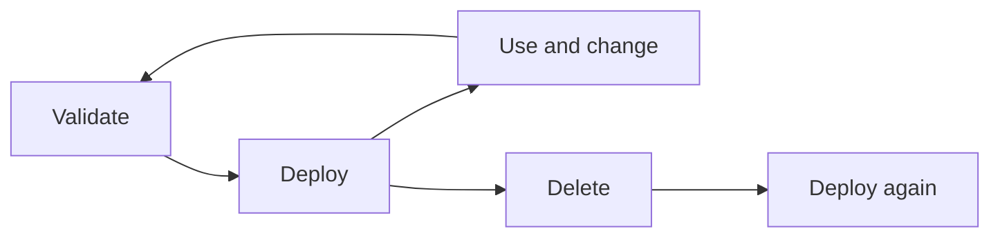

# GitHub Actions workflows overview

| Field | Value |
| --- | --- |
| **Document Title** | GitHub Actions workflows overview |
| **Document Location** | `docs/project-docs/github/workflows/index.md` |
| **Document Description** | Describes the three GitHub Actions workflows that validate, deploy, and delete the Azure infrastructure of aidevme-foundry-image-studio, and the concepts they share: manual triggers, OpenID Connect sign-in, repository variables, the GitHub environment, concurrency, and troubleshooting. It is intended for engineers who run or maintain the workflows. |
| **Version** | 1.1 |
| **Last Updated On** | 2026-09-30 |

## Introduction

The repository contains three GitHub Actions workflows in [.github/workflows/](../../../../.github/workflows/). They manage the lifecycle of an Azure environment that is defined by the Bicep templates in `bicep/`. All three start manually, and none of them runs on its own.

Read this document to learn what the workflows do, which settings they need, and how to run them. Each workflow has its own document with a step-by-step description. The one-time setup of the Azure identity is described in [bicep/README.md](../../../../bicep/README.md#one-time-setup), and this document links to it instead of repeating the commands.

## Workflows

| Workflow | File | Trigger | Purpose | GitHub environment | Key inputs |
| --- | --- | --- | --- | --- | --- |
| Infrastructure validate ([document](infra-validate.md)) | `infra-validate.yml` | Manual (`workflow_dispatch`) | Lint and build the templates and the parameter file, report placeholders, and optionally preview the changes with what-if | Selected environment, for the `what-if` job only | `environment`, `run_what_if` |
| Infrastructure deploy ([document](infra-deploy.md)) | `infra-deploy.yml` | Manual (`workflow_dispatch`) | Check the settings, preview the changes, and deploy the templates to Azure | Selected environment | `environment`, `what_if_only` |
| Infrastructure delete ([document](infra-delete.md)) | `infra-delete.yml` | Manual (`workflow_dispatch`) | Delete the resource group of an environment and purge soft-deleted resources | Selected environment | `environment`, `confirm`, `dry_run`, `purge_soft_deleted` |

## Shared concepts

### Manual triggers

Each workflow declares only the `workflow_dispatch` trigger. A workflow runs when a person starts it from the **Actions** tab or with the GitHub CLI. Merging or pushing a change never deploys or deletes anything.

The workflows are manual because the environment holds a shared Azure subscription with billable services, and a deployment must be a deliberate action. No `pull_request` or `push` workflow exists. A pull request workflow is a proposal (task `T1.4` and decision `TD3` in the Testing section of the [implementation plan](../../../aidevme-foundry-image-studio/IMPLEMENTATION.md)), and it is not implemented.

### Permissions

Every workflow sets the same permissions for the `GITHUB_TOKEN`:

```yaml
permissions:
  id-token: write
  contents: read
```

| Permission | Why the workflow needs it |
| --- | --- |
| `id-token: write` | Allows the job to request an OpenID Connect (OIDC) token from GitHub. `azure/login` exchanges this token for an Azure access token. |
| `contents: read` | Allows `actions/checkout` to read the repository. |

### Sign-in with OpenID Connect

The workflows that talk to Azure use the `azure/login@v2` action with three inputs: `client-id`, `tenant-id`, and `subscription-id`. The action needs no secret. It works as follows:

1. GitHub issues a short-lived OIDC token to the job. The token carries a subject claim that identifies the repository and the GitHub environment.
2. `azure/login` sends the token to Microsoft Entra ID as a client assertion for the app registration that `AZURE_CLIENT_ID` identifies.
3. Microsoft Entra ID compares the token with the federated credentials of that app registration. If the issuer, the subject, and the audience of one credential match, it returns an access token.
4. The Azure CLI commands in the following steps run as the app registration, and the subscription from `AZURE_SUBSCRIPTION_ID` is the default subscription.

The app registration needs one federated credential for each GitHub environment. The credential uses these values:

| Setting | Value |
| --- | --- |
| Issuer | `https://token.actions.githubusercontent.com` |
| Audience | `api://AzureADTokenExchange` |
| Subject | `repo:<owner>@<owner-id>/aidevme-foundry-image-studio@<repo-id>:environment:<name>` |

This repository uses immutable OIDC subject claims. The subject therefore contains the numeric ID of the owner and of the repository instead of only their names. Microsoft Entra ID compares the subject case-sensitively, so the environment name in the credential must match the name in the workflow exactly (lowercase `dev`). The commands to read the IDs and create the credential are in [bicep/README.md](../../../../bicep/README.md#2-deployment-identity-with-oidc-federation). The identity model is described in [section 10.1 of the architecture](../../../aidevme-foundry-image-studio/ARCHITECTURE.md#101-identity-model).

Because the jobs that sign in declare `environment: <name>`, their subject always ends in `:environment:<name>`. No credential for a branch or a pull request is needed.

### Roles of the deployment identity

The templates run at subscription scope, create the resource group, and create role assignments. The app registration therefore needs both of these roles on the subscription:

| Role | Reason |
| --- | --- |
| `Contributor` | Create, update, and delete the resources and the resource group |
| `User Access Administrator` | Create the role assignments in `rbac.bicep` |

The architecture recommends limiting the second role with a condition ([section 10.2](../../../aidevme-foundry-image-studio/ARCHITECTURE.md#102-rbac-least-privilege)). The delete workflow needs the same permissions to delete the resource group and to purge soft-deleted resources.

### GitHub environment

The `deploy`, `delete`, and `what-if` jobs declare `environment: ${{ inputs.environment }}`. The environment named `dev` must exist under **Settings → Environments**. This has two effects:

- The OIDC subject of the job is `environment:dev`, which matches the federated credential.
- If you add required reviewers to the environment, GitHub pauses the job until a reviewer approves it. The pause happens before the first step runs, so no step runs without approval.

Reviewers are optional and recommended for `deploy` and `delete`. The `validate` job does not use an environment, because it does not sign in to Azure.

### Repository variables

The workflows read five repository variables from **Settings → Secrets and variables → Actions → Variables**. None of them is a secret.

| Variable | Used by | Purpose |
| --- | --- | --- |
| `AZURE_SUBSCRIPTION_ID` | `azure/login` in all three workflows | Target Azure subscription |
| `AZURE_TENANT_ID` | `azure/login` in all three workflows | Microsoft Entra tenant |
| `AZURE_CLIENT_ID` | `azure/login` in all three workflows | Application (client) ID of the deployment app registration |
| `AZURE_LOCATION` | Validate and deploy, as the environment variable `AZURE_LOCATION` | Azure region for the deployment. `main.dev.bicepparam` reads it with `readEnvironmentVariable`. |
| `APIM_PUBLISHER_EMAIL` | Validate and deploy, as the environment variable `APIM_PUBLISHER_EMAIL` | Publisher e-mail address of API Management. `main.dev.bicepparam` reads it with `readEnvironmentVariable`. |

The delete workflow does not read `AZURE_LOCATION` or `APIM_PUBLISHER_EMAIL`.

The parameter file also reads `AZURE_PRINCIPAL_ID` with an empty default. No workflow sets it, so the optional role assignments for a person or deployer principal in `rbac.bicep` are skipped in workflow runs.

### Concurrency

Each workflow declares a concurrency group so that two runs do not change the same environment at the same time.

| Workflow | Group | `cancel-in-progress` |
| --- | --- | --- |
| Deploy | `infra-<environment>` | `false` |
| Delete | `infra-<environment>` | `false` |
| Validate | `infra-validate-<environment>` | `true` |

The deploy and delete workflows share the group `infra-<environment>`, so a delete and a deploy for the same environment never overlap. A second run waits for the first run to finish, and the first run is never cancelled. GitHub keeps at most one waiting run in a group, and a newer waiting run replaces an older waiting run. This behavior is a GitHub feature and is not observed in this repository.

The validate workflow uses its own group and cancels an older run of itself, because a validation only reads.

## Run a workflow

You can start a workflow from the GitHub web interface or with the GitHub CLI.

### Run from the Actions tab

1. Open the repository on GitHub and select the **Actions** tab.
2. Select the workflow name in the left pane, for example **Infrastructure deploy**.
3. Select **Run workflow**.
4. Select the branch, enter the inputs, and select **Run workflow**.
5. Select the new run to follow it. If the environment has required reviewers, a reviewer must approve the run first.

### Run with the GitHub CLI

Use `gh workflow run` with one `-f <name>=<value>` option for each input:

```bash
gh workflow run infra-validate.yml -f environment=dev -f run_what_if=true
gh workflow run infra-deploy.yml -f environment=dev -f what_if_only=true
gh workflow run infra-delete.yml -f environment=dev -f confirm=rg-image-studio-dev -f dry_run=true
```

Follow a run with `gh run list --workflow infra-deploy.yml` and `gh run watch`. The input names and defaults of each workflow are in its own document.

## Environments

Only the `dev` environment exists. Each workflow offers `dev` as the only value of the `environment` input. To add an environment such as `test` or `prod`:

1. Add the file `bicep/main.<environment>.bicepparam`.
2. Add the environment name to the `options` list of the `environment` input in all three workflow files.
3. Create a GitHub environment with the same lowercase name, and add required reviewers to it.
4. Create a federated credential for `environment:<environment>` on the app registration, as described in [bicep/README.md](../../../../bicep/README.md#2-deployment-identity-with-oidc-federation).
5. Check the roles of the deployment identity on the subscription of the new environment.

The delete workflow derives the resource group `rg-image-studio-<environment>` and the deployment name `image-studio-<environment>` from the environment name, so it needs no other change. The environment configuration for `test` and `prod` is described in [section 17.1 of the architecture](../../../aidevme-foundry-image-studio/ARCHITECTURE.md).

## Environment lifecycle

The three workflows cover the life of an environment:



1. **Validate.** Run [Infrastructure validate](infra-validate.md) after every change to `bicep/` or to the parameter file. It finds syntax errors, lint findings, and placeholders before anything changes in Azure.
2. **Deploy.** Run [Infrastructure deploy](infra-deploy.md). Use `what_if_only` first to review the changes.
3. **Delete.** Run [Infrastructure delete](infra-delete.md) to remove an environment that is no longer needed. Use `dry_run` first.
4. **Redeploy.** Run the deploy workflow again. It recovers a soft-deleted Key Vault that has purge protection, because that vault cannot be purged and keeps its name reserved. The background is in [section 17.2 of the architecture](../../../aidevme-foundry-image-studio/ARCHITECTURE.md#172-infrastructure-as-code) (ADR-014).

The [implementation plan](../../../aidevme-foundry-image-studio/IMPLEMENTATION.md) states that the first deployment to `dev` had not completed when it was last updated. See [Known limits](#known-limits).

## Troubleshooting

| Symptom | Likely cause | Action |
| --- | --- | --- |
| `Repository variable <name> is not set.` in the `Verify repository variables` step | A repository variable is missing or empty | Create the variable under **Settings → Secrets and variables → Actions → Variables**, and run the workflow again. The five variables are listed above. |
| The `Verify the parameter file has no placeholders` step lists lines and fails | `bicep/main.<environment>.bicepparam` contains a `<...>` placeholder | Replace each placeholder with a value that you verified in the Foundry model catalog, and run the workflow again. The validate workflow only warns about this. |
| `AADSTS700213`: no matching federated identity record found | The subject that GitHub sent does not match any federated credential of the app registration. A frequent cause is a difference in case, for example `Dev` in the credential and `dev` in the workflow, or a credential that uses names instead of the numeric IDs of the immutable subject format. | Compare the subject in the error message with the credential subject character by character. Recreate the credential with the exact subject, as described in [bicep/README.md](../../../../bicep/README.md#2-deployment-identity-with-oidc-federation). |
| `AADSTS7002138` at sign-in | Not confirmed against this repository. Microsoft documents this code for a request without a valid client assertion, so check that the job has `id-token: write` and runs the `azure/login` step with the three IDs. | Check the permissions block, the `client-id`, and the app registration. Read the full error text, and see the Microsoft Entra error code reference. |
| `No subscriptions found` after sign-in | Sign-in succeeded, but the identity has no role assignment on the subscription, so Azure lists no subscription for it | Assign `Contributor` and `User Access Administrator` on the subscription to the app registration, wait a few minutes, and run the workflow again. |
| `FlagMustBeSetForRestore` or a name conflict during deployment | A soft-deleted Foundry or Content Safety account with the same name still exists, for example because the resource group was deleted outside the delete workflow | Run [Infrastructure delete](infra-delete.md) with `purge_soft_deleted` selected. It purges the account even if the resource group no longer exists. Then run the deploy workflow again. |
| Deployment fails because AI Search has insufficient capacity | The selected region has no capacity for the Azure AI Search SKU at that time. The cause is reported from earlier deployment attempts and is not visible in the workflow files. | Try again later, use another region (decision D1), or use another SKU. Record the change in the parameter file or the template. |
| The workflow does not appear in the **Actions** tab or **Run workflow** is missing | GitHub lists a `workflow_dispatch` workflow only after its file exists on the default branch | Push or merge the workflow file to the default branch first. After that, you can select another branch when you run it. |

Other deployment errors, such as `InsufficientQuota` and `AuthorizationFailed`, are listed in the [troubleshooting table of the infrastructure guide](../../../aidevme-foundry-image-studio/INFRASTRUCTURE.md#troubleshooting).

## Known limits

- No workflow has been observed running against a real deployment. This documentation is based on the workflow files, and Azure and GitHub behavior that depends on a real run is marked as not observed.
- No workflow starts from a pull request or a push. A pull request workflow is a proposal.
- Only the `dev` environment exists.
- The workflows deploy infrastructure only. No workflow builds or deploys application code.

## Related documents

- [Infrastructure validate](infra-validate.md)
- [Infrastructure deploy](infra-deploy.md)
- [Infrastructure delete](infra-delete.md)
- [Bicep templates and one-time setup](../../../../bicep/README.md)
- [Infrastructure provisioning with Bicep](../../../aidevme-foundry-image-studio/INFRASTRUCTURE.md#continuous-deployment)
- [Architecture, section 17.3: CI/CD](../../../aidevme-foundry-image-studio/ARCHITECTURE.md#173-cicd-github-actions-oidc-federation-to-azure)
- [Generic Document Style](../../../templates/GENERIC_DOCUMENT_STYLE.md)
- [Documentation index](../../../index.md)
